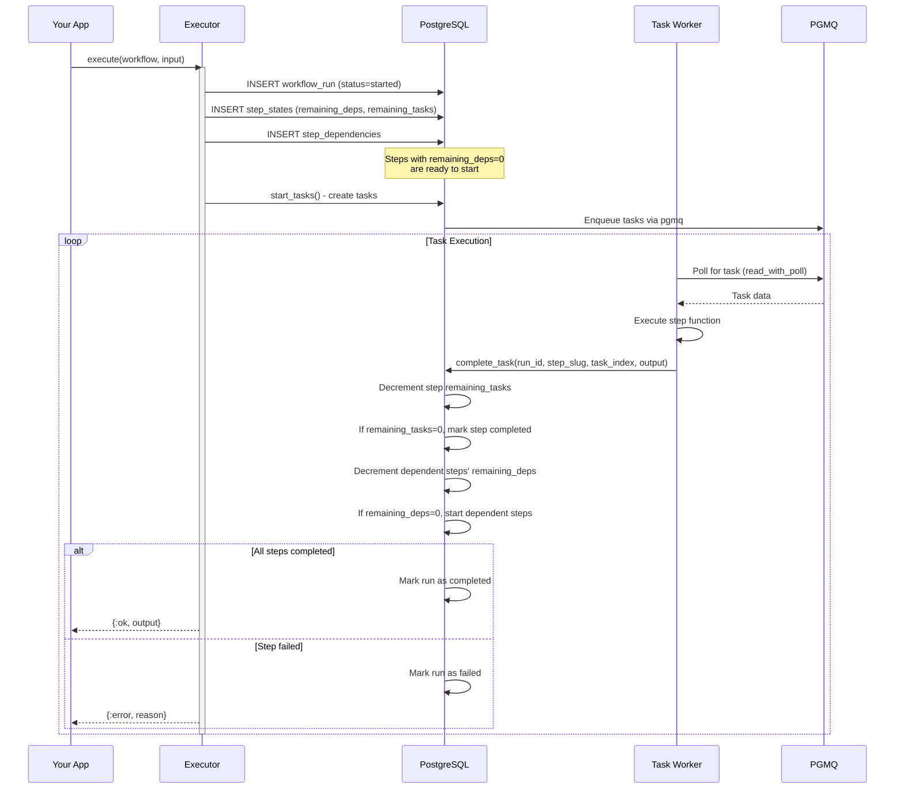
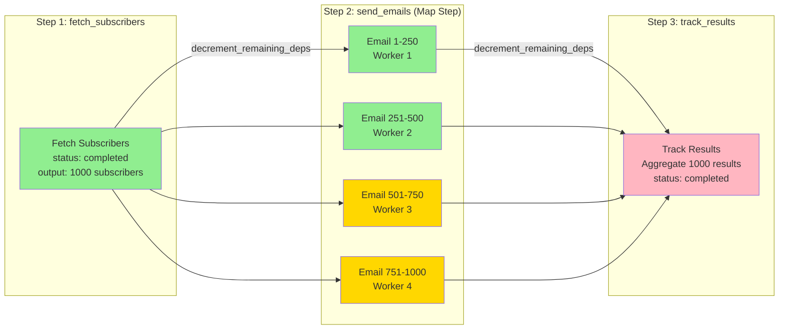

# ex_pgflow

**Elixir implementation of [pgflow](https://pgflow.dev) - Postgres-based workflow orchestration with 100% feature parity**

[](https://hex.pm/packages/ex_pgflow)
[](https://hex.pm/packages/ex_pgflow)
[](https://hexdocs.pm/ex_pgflow)
[](https://github.com/mikkihugo/ex_pgflow/actions)
[](https://opensource.org/licenses/MIT)
[](https://elixir-lang.org/)
[](https://www.postgresql.org/)

## What is ex_pgflow?

ex_pgflow brings the power of [pgflow](https://pgflow.dev) to the Elixir ecosystem. It provides reliable, scalable workflow orchestration using only PostgreSQL - no external dependencies, no message brokers, no complex infrastructure.

## Architecture Overview

```mermaid
graph TB
    subgraph "Application Layer"
        App[Your Elixir App]
        Executor[Pgflow.Executor]
        FlowBuilder[Pgflow.FlowBuilder]
    end

    subgraph "Coordination Layer"
        WorkflowRun[WorkflowRun<br/>Tracks execution]
        StepState[StepState<br/>Counter-based DAG]
        StepTask[StepTask<br/>Task execution + retries]
        StepDep[StepDependency<br/>DAG graph]
    end

    subgraph "PostgreSQL"
        Tables[(Tables:<br/>workflow_runs<br/>workflow_step_states<br/>workflow_step_tasks<br/>workflow_step_dependencies)]
        PGMQ[pgmq Extension<br/>Message Queue]
        Functions[SQL Functions:<br/>start_tasks()<br/>complete_task()<br/>fail_task()]
    end

    App -->|Define workflow| Executor
    App -->|Dynamic workflow| FlowBuilder
    Executor -->|Orchestrates| WorkflowRun
    FlowBuilder -->|Creates| Tables

    WorkflowRun -->|Manages| StepState
    StepState -->|Creates| StepTask
    StepState -->|Reads| StepDep

    StepState -.->|Writes| Tables
    StepTask -.->|Writes| Tables
    PGMQ -.->|Task queue| StepTask
    Functions -.->|Updates| Tables

    style App fill:#E1F5FE
    style PostgreSQL fill:#F1F8E9
    style WorkflowRun fill:#FFE082
    style StepState fill:#A5D6A7
    style StepTask fill:#90CAF9
```

## Workflow Execution Flow



### Key Features

✅ **100% Feature Parity with pgflow.dev**
- All SQL core functions (`start_tasks()`, `complete_task()`, `fail_task()`, etc.)
- pgmq integration (v1.4.4+) for task coordination
- DAG execution with automatic dependency resolution
- Map steps for parallel array processing
- Dynamic workflows via `create_flow()`/`add_step()` API
- Static workflows via Elixir modules

✅ **Zero Infrastructure**
- No Redis, RabbitMQ, or external services required
- Just PostgreSQL (with pgmq extension)
- Perfect for serverless, edge computing, or minimal deployments

✅ **Production-Ready Quality**
- Zero security vulnerabilities (Sobelow strictest scan)
- Zero type errors (Dialyzer with `--warnings-as-errors`)
- Comprehensive test coverage
- Complete documentation

✅ **Elixir Superpowers**
- BEAM concurrency (millions of processes)
- OTP fault tolerance with supervisor trees
- Ecto integration for powerful queries
- Hot code reloading
- Pattern matching for elegant error handling

## Installation

Add `ex_pgflow` to your `mix.exs` dependencies:

\`\`\`elixir
def deps do
  [
    {:ex_pgflow, "~> 0.1.0"}
  ]
end
\`\`\`

## Quick Start

### 1. Install PostgreSQL Extensions

**Option A: Use Docker with pgmq pre-installed (recommended for development)**
\`\`\`bash
docker run -d --name pgmq-postgres \
  -e POSTGRES_PASSWORD=postgres \
  -p 5432:5432 \
  ghcr.io/tembo-io/pgmq-pg:latest
\`\`\`

**Option B: Manual installation**
\`\`\`bash
# Install pgmq extension (required)
mix ecto.migrate
\`\`\`

The migrations will automatically install:
- `pgmq` extension (v1.4.4+)
- All pgflow SQL functions and tables

### 2. Define a Workflow

**Option A: Static Workflow (Elixir Module)**

\`\`\`elixir
defmodule MyApp.EmailCampaign do
  def __workflow_steps__ do
    [
      {:fetch_subscribers, &__MODULE__.fetch/1, depends_on: []},
      {:send_emails, &__MODULE__.send_email/1,
        depends_on: [:fetch_subscribers],
        initial_tasks: 1000},  # Process 1000 emails in parallel
      {:track_results, &__MODULE__.track/1, depends_on: [:send_emails]}
    ]
  end

  def fetch(_input) do
    subscribers = MyApp.Repo.all(MyApp.Subscriber)
    {:ok, Enum.map(subscribers, &%{email: &1.email, id: &1.id})}
  end

  def send_email(input) do
    recipient = Map.get(input, "item")
    MyApp.Mailer.send(recipient["email"])
    {:ok, %{sent: true, email: recipient["email"]}}
  end

  def track(input) do
    # Aggregate results from all email tasks
    {:ok, %{campaign_complete: true}}
  end
end

# Execute the workflow
{:ok, result} = Pgflow.Executor.execute(
  MyApp.EmailCampaign,
  %{"campaign_id" => 123},
  MyApp.Repo
)
\`\`\`

**Option B: Dynamic Workflow (AI/LLM-Generated)**

\`\`\`elixir
alias Pgflow.FlowBuilder

# Create workflow dynamically (perfect for AI agents!)
{:ok, _} = FlowBuilder.create_flow("ai_analysis", repo, timeout: 120)

{:ok, _} = FlowBuilder.add_step("ai_analysis", "fetch_data", [], repo)

{:ok, _} = FlowBuilder.add_step("ai_analysis", "analyze", ["fetch_data"], repo,
  step_type: "map",
  initial_tasks: 50,
  timeout: 300  # 5 minutes for analysis tasks
)

{:ok, _} = FlowBuilder.add_step("ai_analysis", "summarize", ["analyze"], repo)

# Execute with step functions
step_functions = %{
  fetch_data: fn _input -> {:ok, fetch_dataset()} end,
  analyze: fn input -> {:ok, run_ai_analysis(input)} end,
  summarize: fn input -> {:ok, aggregate_results(input)} end
}

{:ok, result} = Pgflow.Executor.execute_dynamic(
  "ai_analysis",
  %{"dataset_id" => "xyz"},
  step_functions,
  repo
)
\`\`\`

## DAG Execution Example

See how ex_pgflow executes workflows with automatic dependency resolution and parallel execution:



**What's happening:**
1. **Step 1 (fetch_subscribers)**: Single task completes, returns 1000 subscribers
2. **Step 2 (send_emails)**:
   - `initial_tasks: 1000` creates 1000 parallel tasks
   - 4 workers process 250 emails each concurrently
   - Each completion decrements `remaining_tasks` counter
3. **Step 3 (track_results)**:
   - Waits for Step 2 (`remaining_deps: 1`)
   - When Step 2 completes, `remaining_deps` → 0, Step 3 starts
   - Aggregates results from all 1000 email tasks

## Why ex_pgflow?

### vs pgflow (TypeScript)

| Feature | pgflow | ex_pgflow |
|---------|--------|-----------|
| Language | TypeScript | Elixir |
| Runtime | Deno/Node.js | BEAM/Erlang |
| Concurrency | Event loop | Millions of processes |
| Fault Tolerance | Edge Function restart | OTP supervisor trees |
| Type Safety | TypeScript | Dialyzer + @spec |
| Database | PostgreSQL + pgmq | PostgreSQL + pgmq |
| **Performance** | Good | **Excellent** (BEAM concurrency) |
| **Fault Tolerance** | Basic | **Advanced** (OTP) |

### vs Oban/BullMQ/Sidekiq

| Feature | ex_pgflow | Oban | BullMQ | Sidekiq |
|---------|-----------|------|--------|---------|
| External Dependencies | None (just Postgres) | None | Redis | Redis |
| DAG Workflows | ✅ Native | ⚠️ Manual | ⚠️ Complex | ❌ |
| Parallel Map Steps | ✅ Built-in | ⚠️ Manual | ⚠️ Manual | ❌ |
| Dynamic Workflows | ✅ create_flow() API | ❌ | ❌ | ❌ |
| Dependency Resolution | ✅ Automatic | ⚠️ Manual | ⚠️ Manual | ❌ |
| Language | Elixir | Elixir | JavaScript | Ruby |

**ex_pgflow excels at:**
- Complex multi-step workflows with dependencies
- Parallel processing of large datasets (map steps)
- AI/LLM agent workflows (dynamic creation)
- Data pipelines with cascading failures

**Use Oban if:**
- You only need simple background jobs
- No workflow orchestration required

## Documentation

- **[GETTING_STARTED.md](GETTING_STARTED.md)** - Installation and first workflow
- **[ARCHITECTURE.md](ARCHITECTURE.md)** - Technical deep dive and design decisions
- **[CONTRIBUTING.md](CONTRIBUTING.md)** - Development guidelines
- **[docs/PGFLOW_DEV_FEATURE_COMPARISON.md](docs/PGFLOW_DEV_FEATURE_COMPARISON.md)** - Complete feature parity checklist
- **[docs/DYNAMIC_WORKFLOWS_GUIDE.md](docs/DYNAMIC_WORKFLOWS_GUIDE.md)** - AI/LLM workflow creation
- **[docs/TIMEOUT_CHANGES_SUMMARY.md](docs/TIMEOUT_CHANGES_SUMMARY.md)** - Timeout configuration details
- **[docs/SECURITY_AUDIT.md](docs/SECURITY_AUDIT.md)** - Security best practices
- **[SECURITY.md](SECURITY.md)** - Vulnerability reporting and best practices

## License

MIT License - see [LICENSE](LICENSE) for details

## Acknowledgments

- **[pgflow](https://pgflow.dev)** by [pgflow team](https://github.com/pgflow/pgflow) - Original TypeScript implementation
- **[pgmq](https://github.com/tembo-io/pgmq)** by Tembo - PostgreSQL message queue extension
- Built with ❤️ using [Elixir](https://elixir-lang.org/) and the [BEAM](https://www.erlang.org/)
