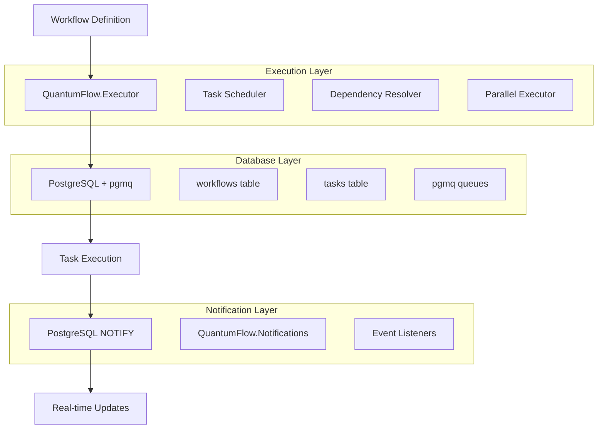

# QuantumFlow (Hex package: quantum_flow)

[](https://hex.pm/packages/quantum_flow)
[](https://hex.pm/packages/quantum_flow)
[](https://travis-ci.org/your-org/quantum_flow)
[](https://coveralls.io/github/your-org/quantum_flow)

**Elixir implementation of QuantumFlow's database-driven DAG execution with 100% feature parity.**

QuantumFlow provides reliable, scalable workflow execution using PostgreSQL + pgmq extension with real-time notifications via PostgreSQL NOTIFY.

## 🚀 Features

- ✅ **Database-Driven DAGs** - Workflows stored and executed via PostgreSQL
- ✅ **Real-time Notifications** - PostgreSQL NOTIFY for instant event delivery
- ✅ **Parallel Execution** - Independent branches run concurrently
- ✅ **Multi-Instance Scaling** - Horizontal scaling via pgmq + PostgreSQL
- ✅ **Comprehensive Logging** - Structured logging for all workflow events
- ✅ **Static & Dynamic Workflows** - Code-based and runtime-generated workflows
- ✅ **Map Steps** - Variable task counts for bulk processing
- ✅ **Dependency Merging** - Steps receive outputs from all dependencies
- ✅ **HTDAG Orchestration** - Goal-driven workflow decomposition (hierarchical task DAGs)
- ✅ **Workflow Optimization** - Learn from execution patterns to optimize future workflows
- ✅ **100% Feature Parity** - Matches QuantumFlow (TypeScript) architecture

## 📋 Table of Contents

- [Quick Start](#quick-start)
- [Architecture](#architecture)
- [Real-time Notifications](#real-time-notifications)
- [Workflow Types](#workflow-types)
- [HTDAG Orchestration](#htdag-orchestration)
- [API Reference](#api-reference)
- [Examples](#examples)
- [Testing](#testing)
- [Deployment](#deployment)
- [Contributing](#contributing)

## 🏃‍♂️ Quick Start

### Installation

Add to your `mix.exs`:

```elixir
def deps do
  [
    {:quantum_flow, "~> 0.1.0"}
  ]
end
```

### Setup

1. **Install PostgreSQL with pgmq extension:**
```bash
# Install pgmq extension
psql -d your_database -c "CREATE EXTENSION IF NOT EXISTS pgmq;"
```

2. **Run migrations:**
```bash
mix ecto.migrate
```

3. **Start your application:**
```elixir
# In your application.ex
def start(_type, _args) do
  children = [
    YourApp.Repo,
    # ... other children
  ]
  Supervisor.start_link(children, strategy: :one_for_one)
end
```

### Basic Usage

```elixir
# Define a simple workflow
defmodule MyWorkflow do
  def __workflow_steps__ do
    [
      {:step1, &__MODULE__.step1/1, depends_on: []},
      {:step2, &__MODULE__.step2/1, depends_on: [:step1]},
      {:step3, &__MODULE__.step3/1, depends_on: [:step1, :step2]}
    ]
  end

  def step1(input), do: {:ok, %{processed: input.data * 2}}
  def step2(input), do: {:ok, %{validated: input.processed > 0}}
  def step3(input), do: {:ok, %{result: input.validated && input.processed}}
end

# Execute workflow
{:ok, result} = QuantumFlow.Executor.execute(MyWorkflow, %{data: 5}, MyApp.Repo)
```

## 🏗️ Architecture



### Core Components

| Component | Purpose | Key Features |
|-----------|---------|--------------|
| **QuantumFlow.Executor** | Workflow execution engine | Static/dynamic workflows, parallel execution |
| **QuantumFlow.FlowBuilder** | Dynamic workflow creation | Runtime workflow generation, AI/LLM integration |
| **QuantumFlow.Notifications** | Real-time event delivery | PostgreSQL NOTIFY, structured logging |
| **PostgreSQL + pgmq** | Data persistence & coordination | ACID transactions, message queuing |
| **Task Scheduler** | Dependency resolution | DAG traversal, parallel execution |

## 🔔 Real-time Notifications

QuantumFlow includes comprehensive real-time notification support via PostgreSQL NOTIFY:

### Send Notifications

```elixir
# Send workflow event with NOTIFY
{:ok, message_id} = QuantumFlow.Notifications.send_with_notify(
  "workflow_events", 
  %{
    type: "task_completed",
    task_id: "task_123",
    workflow_id: "workflow_456",
    status: "success",
    duration_ms: 1500
  }, 
  MyApp.Repo
)
```

### Listen for Events

```elixir
# Start listening for workflow events
{:ok, listener_pid} = QuantumFlow.Notifications.listen("workflow_events", MyApp.Repo)

# Handle notifications
receive do
  {:notification, ^listener_pid, channel, message_id} ->
    Logger.info("Workflow event received: #{channel} -> #{message_id}")
    # Process the notification...
after
  5000 -> :timeout
end

# Stop listening
:ok = QuantumFlow.Notifications.unlisten(listener_pid, MyApp.Repo)
```

### Notification Types

| Event Type | Description | Payload |
|------------|-------------|---------|
| `workflow_started` | Workflow execution begins | `{workflow_id, input}` |
| `task_started` | Individual task starts | `{task_id, workflow_id, step_name}` |
| `task_completed` | Task finishes successfully | `{task_id, result, duration_ms}` |
| `task_failed` | Task fails with error | `{task_id, error, retry_count}` |
| `workflow_completed` | Entire workflow finishes | `{workflow_id, final_result}` |
| `workflow_failed` | Workflow fails | `{workflow_id, error, failed_task}` |

### Structured Logging

All notifications include comprehensive logging:

```elixir
# Success logging
Logger.info("PGMQ + NOTIFY sent successfully",
  queue: "workflow_events",
  message_id: "msg_123",
  duration_ms: 45,
  message_type: "task_completed"
)

# Error logging
Logger.error("PGMQ + NOTIFY send failed",
  queue: "workflow_events",
  error: "Connection timeout",
  message_type: "workflow_started"
)
```

## 🔄 Workflow Types

### 1. Static Workflows (Recommended)

Define workflows as Elixir modules:

```elixir
defmodule DataProcessingWorkflow do
  def __workflow_steps__ do
    [
      {:fetch_data, &__MODULE__.fetch_data/1, depends_on: []},
      {:validate_data, &__MODULE__.validate_data/1, depends_on: [:fetch_data]},
      {:transform_data, &__MODULE__.transform_data/1, depends_on: [:validate_data]},
      {:save_data, &__MODULE__.save_data/1, depends_on: [:transform_data]}
    ]
  end

  def fetch_data(_input) do
    # Fetch data from API
    {:ok, %{data: [1, 2, 3, 4, 5]}}
  end

  def validate_data(input) do
    # Validate data
    valid = Enum.all?(input.data, &is_number/1)
    {:ok, %{valid: valid, data: input.data}}
  end

  def transform_data(input) do
    # Transform data
    transformed = Enum.map(input.data, &(&1 * 2))
    {:ok, %{transformed: transformed}}
  end

  def save_data(input) do
    # Save to database
    {:ok, %{saved: length(input.transformed)}}
  end
end

# Execute
{:ok, result} = QuantumFlow.Executor.execute(DataProcessingWorkflow, %{}, MyApp.Repo)
```

### 2. Dynamic Workflows (AI/LLM Generated)

Create workflows at runtime:

```elixir
# Create workflow
{:ok, workflow_id} = QuantumFlow.FlowBuilder.create_flow("ai_generated_workflow", MyApp.Repo)

# Add steps
{:ok, _} = QuantumFlow.FlowBuilder.add_step(workflow_id, "analyze", [], MyApp.Repo)
{:ok, _} = QuantumFlow.FlowBuilder.add_step(workflow_id, "generate", ["analyze"], MyApp.Repo)
{:ok, _} = QuantumFlow.FlowBuilder.add_step(workflow_id, "validate", ["generate"], MyApp.Repo)

# Define step functions
step_functions = %{
  "analyze" => fn input -> {:ok, %{analysis: "complex"}} end,
  "generate" => fn input -> {:ok, %{content: "generated content"}} end,
  "validate" => fn input -> {:ok, %{valid: true}} end
}

# Execute
{:ok, result} = QuantumFlow.Executor.execute_dynamic(
  workflow_id, 
  %{prompt: "Generate a report"}, 
  step_functions, 
  MyApp.Repo
)
```

### 3. Map Steps (Bulk Processing)

Process multiple items in parallel:

```elixir
defmodule BulkProcessingWorkflow do
  def __workflow_steps__ do
    [
      {:process_items, &__MODULE__.process_items/1, 
       depends_on: [], 
       initial_tasks: 5}  # Process 5 items in parallel
    ]
  end

  def process_items(input) do
    # This function will be called 5 times in parallel
    item_id = input.item_id
    # Process individual item
    {:ok, %{processed_item: item_id, result: "success"}}
  end
end

# Execute with multiple items
items = Enum.map(1..5, &%{item_id: &1})
{:ok, results} = QuantumFlow.Executor.execute(BulkProcessingWorkflow, %{items: items}, MyApp.Repo)
```

## 🎯 HTDAG Orchestration

QuantumFlow includes Hierarchical Task DAG (HTDAG) support for **goal-driven workflow decomposition**. Convert high-level goals into executable workflows automatically.

### Quick Example

```elixir
# Define a goal decomposer
defmodule MyApp.GoalDecomposer do
  def decompose("Build authentication system") do
    {:ok, [
      %{id: "design", description: "Design auth flow", depends_on: []},
      %{id: "implement", description: "Implement", depends_on: ["design"]},
      %{id: "test", description: "Test", depends_on: ["implement"]}
    ]}
  end
end

# Define step functions
step_functions = %{
  "design" => &MyApp.Tasks.design_auth/1,
  "implement" => &MyApp.Tasks.implement_auth/1,
  "test" => &MyApp.Tasks.test_auth/1
}

# Execute goal-driven workflow
{:ok, result} = QuantumFlow.WorkflowComposer.compose_from_goal(
  "Build authentication system",
  &MyApp.GoalDecomposer.decompose/1,
  step_functions,
  MyApp.Repo,
  optimization_level: :advanced,
  monitoring: true
)
```

### Key Features

- **Automatic Decomposition**: Convert goals to task graphs
- **Optimization**: Learn from execution patterns to optimize future workflows
- **Three Optimization Levels**: `:basic` (safe) → `:advanced` (smart) → `:aggressive` (ML-based)
- **Real-time Monitoring**: Event-driven notifications during execution
- **Multi-Workflow Composition**: Execute multiple goals in parallel

### Components

| Module | Purpose |
|--------|---------|
| `QuantumFlow.Orchestrator` | Goal decomposition engine |
| `QuantumFlow.WorkflowComposer` | High-level composition API |
| `QuantumFlow.OrchestratorOptimizer` | Optimization engine with learning |
| `QuantumFlow.OrchestratorNotifications` | Real-time event broadcasting |

For detailed guide, see [HTDAG_ORCHESTRATOR_GUIDE.md](docs/HTDAG_ORCHESTRATOR_GUIDE.md).

## 📚 API Reference

### QuantumFlow.Executor

```elixir
# Execute static workflow
QuantumFlow.Executor.execute(workflow_module, input, repo, opts \\ [])

# Execute dynamic workflow
QuantumFlow.Executor.execute_dynamic(workflow_id, input, step_functions, repo, opts \\ [])

# Options
opts = [
  timeout: 30_000,           # Execution timeout (ms)
  max_retries: 3,            # Retry failed tasks
  parallel: true,            # Enable parallel execution
  notify_events: true        # Send NOTIFY events
]
```

### QuantumFlow.FlowBuilder

```elixir
# Create workflow
QuantumFlow.FlowBuilder.create_flow(name, repo)

# Add step
QuantumFlow.FlowBuilder.add_step(workflow_id, step_name, depends_on, repo)

# Add map step
QuantumFlow.FlowBuilder.add_map_step(workflow_id, step_name, depends_on, initial_tasks, repo)

# Get workflow
QuantumFlow.FlowBuilder.get_workflow(workflow_id, repo)

# List workflows
QuantumFlow.FlowBuilder.list_workflows(repo)
```

### QuantumFlow.Notifications

```elixir
# Send with NOTIFY
QuantumFlow.Notifications.send_with_notify(queue_name, message, repo)

# Listen for events
QuantumFlow.Notifications.listen(queue_name, repo)

# Stop listening
QuantumFlow.Notifications.unlisten(pid, repo)

# Send NOTIFY only (no persistence)
QuantumFlow.Notifications.notify_only(channel, payload, repo)
```

## 🧪 Testing

### Running Tests

```bash
# Run all tests
mix test

# Run with coverage
mix test --cover

# Run specific test file
mix test test/QuantumFlow/executor_test.exs
```

### Test Structure

```
test/
├── QuantumFlow/
│   ├── executor_test.exs           # Workflow execution tests
│   ├── flow_builder_test.exs       # Dynamic workflow tests
│   ├── notifications_test.exs      # NOTIFY functionality tests
│   └── integration_test.exs        # End-to-end tests
├── support/
│   ├── test_repo.ex                # Test database setup
│   └── workflow_helpers.ex         # Test utilities
└── test_helper.exs                 # Test configuration
```

### Example Test

```elixir
defmodule QuantumFlow.ExecutorTest do
  use ExUnit.Case, async: true
  alias QuantumFlow.Executor

  test "executes simple workflow" do
    defmodule TestWorkflow do
      def __workflow_steps__ do
        [{:step1, &__MODULE__.step1/1, depends_on: []}]
      end
      def step1(input), do: {:ok, %{result: input.value * 2}}
    end

    {:ok, result} = Executor.execute(TestWorkflow, %{value: 5}, TestRepo)
    assert result.step1.result == 10
  end
end
```

## 🚀 Examples

### Complete Examples

Check the `examples/` directory for comprehensive examples:

- **`simple_workflow.ex`** - Basic workflow execution
- **`parallel_processing.ex`** - Map steps and parallel execution
- **`dynamic_workflow.ex`** - Runtime workflow generation
- **`notifications_demo.ex`** - Real-time notification handling
- **`error_handling.ex`** - Retry logic and error recovery

### Integration Examples

- **`phoenix_integration.ex`** - Phoenix LiveView integration
- **`ai_workflow_generation.ex`** - LLM-generated workflows
- **`microservices_coordination.ex`** - Multi-service workflows

## 📦 Deployment

### Production Configuration

```elixir
# config/prod.exs
config :QuantumFlow,
  repo: MyApp.Repo,
  pgmq_url: System.get_env("DATABASE_URL"),
  notification_channels: ["workflow_events", "task_events"],
  max_retries: 3,
  default_timeout: 30_000
```

### Docker Support

```dockerfile
# Dockerfile
FROM elixir:1.15-alpine

WORKDIR /app
COPY . .
RUN mix deps.get && mix compile

CMD ["mix", "phx.server"]
```

### Kubernetes Deployment

```yaml
# k8s/deployment.yaml
apiVersion: apps/v1
kind: Deployment
metadata:
  name: quantum_flow-app
spec:
  replicas: 3
  selector:
    matchLabels:
      app: quantum_flow-app
  template:
    metadata:
      labels:
        app: quantum_flow-app
    spec:
      containers:
      - name: QuantumFlow
        image: QuantumFlow:latest
        env:
        - name: DATABASE_URL
          valueFrom:
            secretKeyRef:
              name: quantum_flow-secrets
              key: database-url
```

## 🤝 Contributing

### Development Setup

```bash
# Clone repository
git clone https://github.com/your-org/QuantumFlow.git
cd QuantumFlow

# Install dependencies
mix deps.get

# Setup database
mix ecto.setup

# Run tests
mix test
```

### Code Quality

```bash
# Format code
mix format

# Lint code
mix credo

# Type check
mix dialyzer

# Security scan
mix sobelow
```

### Pull Request Process

1. Fork the repository
2. Create feature branch (`git checkout -b feature/amazing-feature`)
3. Commit changes (`git commit -m 'Add amazing feature'`)
4. Push to branch (`git push origin feature/amazing-feature`)
5. Open Pull Request

## 📄 License

This project is licensed under the MIT License - see the [LICENSE.md](LICENSE.md) file for details.

## 🙏 Acknowledgments

- **QuantumFlow** - Original TypeScript implementation
- **PostgreSQL** - Robust database foundation
- **pgmq** - Message queuing extension
- **Elixir Community** - Amazing ecosystem

## 📞 Support

- **Documentation**: [https://hexdocs.pm/QuantumFlow](https://hexdocs.pm/QuantumFlow)
- **Issues**: [GitHub Issues](https://github.com/your-org/QuantumFlow/issues)
- **Discussions**: [GitHub Discussions](https://github.com/your-org/QuantumFlow/discussions)
- **Email**: support@QuantumFlow.dev

---

**Made with ❤️ by the QuantumFlow Team**
