# ex_pgflow

**AI-first, database-driven workflow orchestration for the BEAM, following the [pgflow](https://pgflow.dev) SQL coordination pattern**

[](https://hex.pm/packages/ex_pgflow)
[](https://hex.pm/packages/ex_pgflow)
[](https://hexdocs.pm/ex_pgflow)
[](https://github.com/mikkihugo/ex_pgflow/actions)
[](https://opensource.org/licenses/MIT)
[](https://elixir-lang.org/)
[](https://www.erlang.org/)
[](https://www.postgresql.org/)

## What is ex_pgflow?

An Elixir implementation of [pgflow](https://pgflow.dev)'s database-driven workflow orchestration, designed for reliable distributed systems on the BEAM. Builds on PostgreSQL's ACID guarantees and pgmq extension for coordination, following OTP principles for fault tolerance.

Perfect for **AI agents**, **data pipelines**, and **distributed workflows** that need dependency coordination, automatic fault recovery, and observable execution.

## Real-World Use Cases

### 1. Agentic AI & Multi-Agent Systems ⭐

ex_pgflow is purpose-built for AI agent orchestration:

**Single Agent Workflow**

```mermaid
graph LR
    A["🔍 User Query<br/>(input)"] --> B["🧠 LLM Analysis<br/>(analysis)"]
    B --> C["🔧 Tool Calls<br/>(parallel)"]
    C --> D["📊 Aggregation<br/>(collect)"]
    D --> E["💬 Response<br/>(output)"]

    style A fill:#E3F2FD
    style B fill:#BBDEFB
    style C fill:#FFE082
    style D fill:#FFE082
    style E fill:#A5D6A7
```



**Multi-Agent Collaboration**

```mermaid
graph TB
    A["📋 Task Definition"]

    A --> B["🔬 Agent 1: Research"]
    A --> C["📈 Agent 2: Analysis"]
    A --> D["✓ Agent 3: Validation"]

    B --> B1["[Subtasks]"]
    C --> C1["[Analysis]"]
    D --> D1["[Checks]"]

    B1 --> E["🔄 Consolidate Results"]
    C1 --> E
    D1 --> E

    E --> F["🎯 Final Decision"]
    F --> G["📤 Return to User"]

    style A fill:#E3F2FD
    style B fill:#90CAF9
    style C fill:#90CAF9
    style D fill:#90CAF9
    style E fill:#FFE082
    style F fill:#FFE082
    style G fill:#A5D6A7
```



**Dynamic Workflow Generation** (perfect for AI agents that plan their own workflows):
```elixir
# Claude creates a workflow to solve a problem
{:ok, _} = FlowBuilder.create_flow("claude_analysis", repo)
{:ok, _} = FlowBuilder.add_step("claude_analysis", "research", [])
{:ok, _} = FlowBuilder.add_step("claude_analysis", "analyze", ["research"])
{:ok, _} = FlowBuilder.add_step("claude_analysis", "validate", ["analyze"])
# Agent can now orchestrate its own execution!
```

**Benefits for AI:**
- ✅ Automatic fault recovery (tasks fail and retry independently)
- ✅ Distributed execution across multiple workers/GPU nodes
- ✅ Dependency-aware execution (Agent 2 waits for Agent 1)
- ✅ Tool call parallelization (parallel API calls, vector searches)
- ✅ Stateful workflows (state persists in PostgreSQL)
- ✅ Observable (every step, task, and retry is logged)

### 2. Data Processing Pipelines

**ETL/ELT Workflows with Error Isolation**

```mermaid
graph LR
    A["📥 Extract Data<br/>(1 task)"] --> B["✓ Validation<br/>(10k tasks)"]
    B --> C["🧹 Cleaning<br/>(10k tasks)"]
    C --> D["🔄 Transformation<br/>(10k tasks)"]
    D --> E["💾 Load<br/>(1 task)"]

    style A fill:#A5D6A7
    style B fill:#FFE082
    style C fill:#FFE082
    style D fill:#FFE082
    style E fill:#90CAF9
```



Each validation failure doesn't block the whole pipeline—failed records are retried independently. Failed items can be tracked and reprocessed.

**Features Perfect for Data Pipelines:**
- ✅ Map steps for parallel processing of millions of records
- ✅ Counter-based coordination prevents data loss
- ✅ Failed items automatically retry (configurable backoff)
- ✅ Aggregation steps combine partial results
- ✅ Progress tracking (SQL queries show what's done)

### 3. Computer Vision & ML Model Inference

**Batch Image Processing**

```mermaid
graph LR
    A["📤 Upload<br/>Image Batch"] --> B["🔧 Preprocess<br/>(parallel)<br/>100 images"]
    B --> C["🧠 Model<br/>Inference<br/>(parallel)<br/>100 inferences"]
    C --> D["🎨 Postprocess<br/>(parallel)<br/>100 transforms"]
    D --> E["💾 Store<br/>Results"]

    style A fill:#E3F2FD
    style B fill:#FFE082
    style C fill:#FFE082
    style D fill:#FFE082
    style E fill:#A5D6A7
```



**Multi-Model Ensemble**

```mermaid
graph TB
    A["📸 Single Image"]

    A --> B["🤖 Model A<br/>(parallel)"]
    A --> C["🤖 Model B<br/>(parallel)"]
    A --> D["🤖 Model C<br/>(parallel)"]

    B --> E["🔄 Aggregate"]
    C --> E
    D --> E

    E --> F["🗳️ Voting"]
    F --> G["📊 Confidence Score"]
    G --> H["✅ Return"]

    style A fill:#E3F2FD
    style B fill:#FFE082
    style C fill:#FFE082
    style D fill:#FFE082
    style E fill:#BBDEFB
    style F fill:#BBDEFB
    style G fill:#BBDEFB
    style H fill:#A5D6A7
```



### 4. Microservice Orchestration

**Service-to-Service Workflow Coordination**

```mermaid
graph TB
    A["📥 API Request"]

    A --> B["👤 User Service<br/>(gets user data)"]
    B --> C["📦 Order Service<br/>(gets order data)"]
    C --> D["💳 Payment Service<br/>(processes payment)"]
    D --> E1["✉️ Email<br/>(parallel)"]
    D --> E2["📱 SMS<br/>(parallel)"]
    D --> E3["🔗 Webhook<br/>(parallel)"]

    E1 --> F["📤 Response"]
    E2 --> F
    E3 --> F

    style A fill:#E3F2FD
    style B fill:#BBDEFB
    style C fill:#BBDEFB
    style D fill:#FFE082
    style E1 fill:#C8E6C9
    style E2 fill:#C8E6C9
    style E3 fill:#C8E6C9
    style F fill:#A5D6A7
```



**Benefits:**
- ✅ Resilient: If Payment Service crashes, other steps are unaffected
- ✅ Observable: See which microservice is slow
- ✅ Stateful: Database tracks service call results
- ✅ Recoverable: Restart failed steps without redoing successful ones

### 5. Report Generation & Data Synthesis

**Multi-Section Report Generation**

```mermaid
graph TB
    A["📊 Report Request"]

    A --> B["📈 Section A<br/>Sales Analysis<br/>(parallel)"]
    A --> C["📢 Section B<br/>Marketing Analysis<br/>(parallel)"]
    A --> D["⚙️ Section C<br/>Operations Analysis<br/>(parallel)"]

    B --> E["🔄 Aggregate<br/>& Format"]
    C --> E
    D --> E

    E --> F["📄 PDF<br/>Generation"]
    F --> G["📤 Send to<br/>User"]

    style A fill:#E3F2FD
    style B fill:#FFE082
    style C fill:#FFE082
    style D fill:#FFE082
    style E fill:#BBDEFB
    style F fill:#BBDEFB
    style G fill:#A5D6A7
```



### 6. Document Processing Pipeline

**Scanning to Searchable Documents**

```mermaid
graph TB
    A["📄 Raw PDF<br/>Upload"]

    A --> B["✓ Validate PDF"]
    B --> C["📝 Extract Text<br/>(parallel)<br/>20 pages"]
    B --> D["🖼️ OCR Images<br/>(parallel)<br/>20 pages"]

    C --> E["🏷️ Parse Entities<br/>(parallel)<br/>names, dates, etc."]
    D --> E

    E --> F["🔗 Generate<br/>Embeddings<br/>(parallel)"]
    F --> G["💾 Store in<br/>Vector DB<br/>(atomic)"]
    G --> H["🔍 Index Search<br/>(Elasticsearch)"]

    H --> I["✅ Document<br/>Available for<br/>Search"]

    style A fill:#E3F2FD
    style B fill:#BBDEFB
    style C fill:#FFE082
    style D fill:#FFE082
    style E fill:#FFE082
    style F fill:#FFE082
    style G fill:#C8E6C9
    style H fill:#C8E6C9
    style I fill:#A5D6A7
```



### 7. Real-Time Analytics & Stream Processing

**Streaming Data Aggregation**

```mermaid
graph LR
    A["📡 Event Stream<br/>(Kafka/NATS/etc)"]
    B["📦 Buffer & Batch<br/>(every 100 events)"]
    C["📊 Aggregate<br/>(parallel)"]
    D["🔄 Transform<br/>(parallel)"]
    E["💾 Store Metrics"]

    A --> B
    B --> C
    C --> D
    D --> E

    style A fill:#E3F2FD
    style B fill:#BBDEFB
    style C fill:#FFE082
    style D fill:#FFE082
    style E fill:#A5D6A7
```



### 8. Recommendation System Pipelines

**Cold-Start Recommendation Generation**

```mermaid
graph TB
    A["👤 New User<br/>Signup"]

    A --> B["👥 Fetch User<br/>Profile"]
    B --> C1["📚 Get Historical<br/>Items<br/>(parallel)<br/>10k items"]
    B --> C2["🔎 Find Similar<br/>Users<br/>(parallel, GPU)<br/>vector search"]

    C1 --> D["🔄 Aggregate<br/>Candidates"]
    C2 --> D

    D --> E["⭐ Score<br/>& Rank"]
    E --> F["🎯 Diversify"]
    F --> G["✅ Return Top 10"]

    style A fill:#E3F2FD
    style B fill:#BBDEFB
    style C1 fill:#FFE082
    style C2 fill:#FFE082
    style D fill:#BBDEFB
    style E fill:#BBDEFB
    style F fill:#BBDEFB
    style G fill:#A5D6A7
```



## When to Use ex_pgflow

### Use ex_pgflow when:

1. **Workflows have dependencies** - Step B must wait for Step A
2. **Fault recovery matters** - Failed steps retry independently
3. **Parallelization is needed** - Process 1M items across workers
4. **You're building agents** - AI agents need dynamic workflow coordination
5. **State persists in DB** - Results must survive worker crashes
6. **Observability is critical** - Need to see every step, task, attempt
7. **You use PostgreSQL anyway** - No new infrastructure required

### Use Oban when:

1. **Jobs are independent** - No inter-job dependencies
2. **Simple fire-and-forget** - Job runs, reports result, done
3. **Standard job queue** - Typical background job scenarios

## Quick Start

### 1. Install PostgreSQL Extensions

**Option A: Use Docker with pgmq pre-installed (recommended for development)**
```bash
# PostgreSQL 18 (latest) with pgmq - RECOMMENDED
docker run -d --name pgmq-postgres \
  -e POSTGRES_PASSWORD=postgres \
  -p 5432:5432 \
  ghcr.io/pgmq/pg18-pgmq:latest

# Or use our custom image (PostgreSQL 18 + pgmq, optimized for ex_pgflow)
docker run -d --name pgmq-postgres \
  -e POSTGRES_PASSWORD=postgres \
  -p 5432:5432 \
  ghcr.io/mikkihugo/ex_pgflow-postgres:pg18-pgmq
```

**Option B: Manual installation**
```bash
# Install pgmq extension (required)
mix ecto.migrate
```

The migrations will automatically install:
- `pgmq` extension (v1.4.4+)
- All pgflow SQL functions and tables

### 2. Define a Workflow

**Option A: Static Workflow (Elixir Module)**

```elixir
defmodule MyApp.EmailCampaign do
  def __workflow_steps__ do
    [
      {:fetch_subscribers, &__MODULE__.fetch/1, depends_on: []},
      {:send_emails, &__MODULE__.send_email/1,
        depends_on: [:fetch_subscribers],
        initial_tasks: 1000},  # Process 1000 emails in parallel
      {:track_results, &__MODULE__.track/1, depends_on: [:send_emails]}
    ]
  end

  def fetch(_input) do
    subscribers = MyApp.Repo.all(MyApp.Subscriber)
    {:ok, Enum.map(subscribers, &%{email: &1.email, id: &1.id})}
  end

  def send_email(input) do
    recipient = Map.get(input, "item")
    MyApp.Mailer.send(recipient["email"])
    {:ok, %{sent: true, email: recipient["email"]}}
  end

  def track(input) do
    # Aggregate results from all email tasks
    {:ok, %{campaign_complete: true}}
  end
end

# Execute the workflow
{:ok, result} = Pgflow.Executor.execute(
  MyApp.EmailCampaign,
  %{"campaign_id" => 123},
  MyApp.Repo
)
```

**Option B: Dynamic Workflow (AI/LLM-Generated)**

```elixir
alias Pgflow.FlowBuilder

# Create workflow dynamically (perfect for AI agents!)
{:ok, _} = FlowBuilder.create_flow("ai_analysis", repo, timeout: 120)

{:ok, _} = FlowBuilder.add_step("ai_analysis", "fetch_data", [], repo)

{:ok, _} = FlowBuilder.add_step("ai_analysis", "analyze", ["fetch_data"], repo,
  step_type: "map",
  initial_tasks: 50,
  timeout: 300  # 5 minutes for analysis tasks
)

{:ok, _} = FlowBuilder.add_step("ai_analysis", "summarize", ["analyze"], repo)

# Execute with step functions
step_functions = %{
  fetch_data: fn _input -> {:ok, fetch_dataset()} end,
  analyze: fn input -> {:ok, run_ai_analysis(input)} end,
  summarize: fn input -> {:ok, aggregate_results(input)} end
}

{:ok, result} = Pgflow.Executor.execute_dynamic(
  "ai_analysis",
  %{"dataset_id" => "xyz"},
  step_functions,
  repo
)
```

## How It Works

### Architecture Overview


### Workflow Execution Flow


## Examples & Patterns

### DAG Execution Example

See how ex_pgflow executes workflows with automatic dependency resolution and parallel execution:


**What's happening:**
1. **Step 1 (fetch_subscribers)**: Single task completes, returns 1000 subscribers
2. **Step 2 (send_emails)**:
   - `initial_tasks: 1000` creates 1000 parallel tasks
   - 4 workers process 250 emails each concurrently
   - Each completion decrements `remaining_tasks` counter
3. **Step 3 (track_results)**:
   - Waits for Step 2 (`remaining_deps: 1`)
   - When Step 2 completes, `remaining_deps` → 0, Step 3 starts
   - Aggregates results from all 1000 email tasks

## Installation

Add `ex_pgflow` to your `mix.exs` dependencies:

```elixir
def deps do
  [
    {:ex_pgflow, "~> 0.1.0"}
  ]
end
```

Then run:
```bash
mix deps.get
mix ecto.migrate
```

## Technical Characteristics

**SQL Layer Compatibility**
- Implements pgflow's SQL functions (`start_tasks()`, `complete_task()`, `fail_task()`)
- Compatible with pgmq 1.4.4+ for task coordination
- Counter-based DAG execution with dependency resolution
- Map steps for parallel processing across array elements
- Dynamic workflow creation via SQL schema
- Static workflow definition via Elixir modules

**BEAM Integration**
- Process-based concurrency model (lightweight processes per task)
- OTP supervision for fault isolation and recovery
- Ecto for PostgreSQL interactions and schema management
- Pattern matching for error handling and state transitions

**Quality Assurance**
- Static analysis via Dialyzer with strict warnings
- Security scanning via Sobelow
- Test coverage on core coordination logic
- Documentation generated from source

## Technical Context

### Relationship to pgflow (TypeScript)

This implementation follows pgflow's SQL-based coordination model while adapting to the BEAM's process model:

| Aspect | pgflow | ex_pgflow |
|--------|--------|-----------|
| Runtime | Deno/Node.js | BEAM (Erlang VM) |
| Concurrency | Event loop + async/await | Process-based (preemptive scheduling) |
| Fault Model | Function restart | OTP supervision trees |
| Type System | TypeScript static typing | Dialyzer gradual typing + @spec |
| SQL Layer | Direct implementation | Same SQL functions, Ecto integration |

Both share the pgmq-based coordination layer. The primary difference is runtime characteristics: JavaScript's single-threaded event loop versus BEAM's preemptive process scheduler.

### Relationship to Other Job Systems

Different tools serve different coordination patterns:

| System | Coordination Model | Dependencies | Primary Use Case |
|--------|-------------------|--------------|------------------|
| ex_pgflow | DAG-based (counter coordination) | PostgreSQL | Multi-step workflows with dependencies |
| Oban | Queue-based | PostgreSQL | Independent background jobs |
| BullMQ | Queue-based | Redis | Node.js job processing |
| Sidekiq | Queue-based | Redis | Ruby background processing |

## Documentation

- **[GETTING_STARTED.md](GETTING_STARTED.md)** - Installation and first workflow
- **[ARCHITECTURE.md](ARCHITECTURE.md)** - Technical deep dive and design decisions
- **[CONTRIBUTING.md](CONTRIBUTING.md)** - Development guidelines
- **[docs/PGFLOW_DEV_FEATURE_COMPARISON.md](docs/PGFLOW_DEV_FEATURE_COMPARISON.md)** - Complete feature parity checklist
- **[docs/DYNAMIC_WORKFLOWS_GUIDE.md](docs/DYNAMIC_WORKFLOWS_GUIDE.md)** - AI/LLM workflow creation
- **[docs/TIMEOUT_CHANGES_SUMMARY.md](docs/TIMEOUT_CHANGES_SUMMARY.md)** - Timeout configuration details
- **[docs/SECURITY_AUDIT.md](docs/SECURITY_AUDIT.md)** - Security best practices
- **[SECURITY.md](SECURITY.md)** - Vulnerability reporting and best practices

## License

MIT License - see [LICENSE](LICENSE) for details

## Acknowledgments

This work stands on the shoulders of significant prior contributions:

**Core Technologies:**
- **[Erlang/OTP](https://www.erlang.org/)** - The foundation. Developed at Ericsson for telecommunications systems, now maintained by the OTP team. The BEAM VM's process model, supervision, and fault tolerance principles are central to this implementation.
- **[Elixir](https://elixir-lang.org/)** - José Valim and the Elixir core team. Provides the ergonomic interface to OTP patterns and metaprogramming capabilities used here.
- **[PostgreSQL](https://www.postgresql.org/)** - The PostgreSQL Global Development Group. The ACID guarantees and extensibility (pgmq) enable the coordination model.

**Direct Dependencies:**
- **[pgflow](https://pgflow.dev)** - The pgflow team's original implementation established the SQL-based coordination pattern and counter-based DAG execution. This is a faithful port of their design to the BEAM.
- **[pgmq](https://github.com/tembo-io/pgmq)** - Tembo's PostgreSQL message queue extension. Provides the task queueing layer with atomic operations.
- **[Ecto](https://github.com/elixir-ecto/ecto)** - Michał Muskała, José Valim, and contributors. The database integration layer.

**Inspiration:**
- Ericsson's telecom systems for the original OTP principles
- The Erlang community's decades of distributed systems experience
- The pgflow team's insight that PostgreSQL can serve as workflow coordinator

Thank you to all maintainers and contributors of these projects.
