# QuantumFlow Architecture

QuantumFlow is an Elixir implementation of QuantumFlow's database-driven DAG execution engine. This document explains the internal architecture, design decisions, and how components interact.

## Architecture Overview

```mermaid
%%{init: {'theme':'dark'}}%%
graph TB
    App["📱 Application Layer<br/>(Executor, FlowBuilder, Workflows)"]

    subgraph "Orchestration"
        DAG["🔄 DAG Layer<br/>(Parsing, Validation, Cycles)"]
        Exec["⚙️ Execution Layer<br/>(Tasks, State, Tracking)"]
    end

    subgraph "Persistence"
        DB["🗄️ PostgreSQL<br/>(Tables, Functions)"]
        Queue["📬 pgmq<br/>(Task Queue)"]
    end

    App --> DAG
    App --> Exec
    DAG --> DB
    Exec --> DB
    Exec --> Queue
    DB --> Queue
```



### Layer Stack

QuantumFlow is organized into three layers:

1. **Application Layer** - Workflow definitions, user code entry points
2. **Orchestration Layer** - DAG parsing/validation and task execution coordination
3. **Persistence Layer** - PostgreSQL database and pgmq message queue

## Layer 1: DAG (Directed Acyclic Graph)

The DAG layer handles workflow definition parsing, validation, and graph analysis.

### Key Modules

**QuantumFlow.DAG.WorkflowDefinition** (`lib/QuantumFlow/dag/workflow_definition.ex`)
- Parses JSON workflow definitions
- Validates step structure and dependencies
- Detects cycles to prevent infinite loops
- Extracts dependency edges for execution planning

```elixir
# Example: Parse and validate a workflow
definition = %{
  "version" => "1.0",
  "title" => "My Workflow",
  "steps" => [
    %{"name" => "step1", "type" => "task", "command" => "cmd1"},
    %{"name" => "step2", "type" => "task", "command" => "cmd2",
      "dependencies" => ["step1"]}
  ]
}

{:ok, workflow} = WorkflowDefinition.parse(definition)
```

**QuantumFlow.DAG.DynamicWorkflowLoader** (`lib/QuantumFlow/dag/dynamic_workflow_loader.ex`)
- Loads workflow definitions from modules at runtime
- Implements dynamic behavior callbacks
- Bridges workflow code and engine execution

### Cycle Detection Algorithm

WorkflowDefinition uses depth-first search (DFS) to detect cycles. The algorithm prevents workflows from creating infinite loops:

```mermaid
%%{init: {'theme':'dark'}}%%
graph TB
    A["Start: For each unvisited node"]
    B["Mark as VISITING"]
    C["Recursively visit all dependencies"]
    D{"Is dependency<br/>VISITING?"}
    E["🚨 CYCLE DETECTED<br/>(Error)"]
    F["Mark as VISITED"]
    G["All nodes visited?"]
    H["✅ No cycles found<br/>(Valid DAG)"]

    A --> B
    B --> C
    C --> D
    D -->|Yes| E
    D -->|No| F
    F --> G
    G -->|No| A
    G -->|Yes| H

    style E fill:#d32f2f,color:#fff
    style H fill:#388e3c,color:#fff
```



This ensures **acyclic** dependency graphs required for safe parallel execution.

## Layer 2: Execution

The execution layer orchestrates task processing, state management, and completion logic.

### Key Modules

**QuantumFlow.Executor** (`lib/QuantumFlow/executor.ex`)
- Main entry point for starting and monitoring workflows
- Delegates to DAG for definition parsing
- Initializes workflow state in database
- Orchestrates polling loop for task execution

```elixir
# Example: Start and execute a workflow
{:ok, run_id} = Executor.start_workflow(MyWorkflow, %{"input" => "data"})
{:ok, executed} = Executor.execute_pending_tasks()
{:ok, run} = Executor.status(run_id)
```

**QuantumFlow.DAG.RunInitializer** (`lib/QuantumFlow/dag/run_initializer.ex`)
- Creates workflow_runs record
- Initializes step_states for all workflow steps
- Sets up step_dependencies edges
- For map steps, creates one task per item

**QuantumFlow.DAG.TaskExecutor** (`lib/QuantumFlow/dag/task_executor.ex`)
- Polls pgmq queue for pending tasks
- Executes tasks via workflow callback functions
- Handles retries and error handling
- Updates task state after execution
- Checks if run is complete and calls completion handler

### Execution Flow Diagram


**Key Points:**

1. **Initialization Phase** - All steps and dependencies created in a transaction
2. **Polling Loop** - TaskExecutor continuously polls pgmq for tasks
3. **Parallel Execution** - Multiple workers can poll the same queue simultaneously
4. **Dependency Resolution** - Each step completion checks and enqueues dependent steps

### Counter-Based Coordination

QuantumFlow uses two counters to track completion:


**Why counters?**
- O(1) completion check (no row counting)
- Atomic decrements via SQL
- No race conditions with ACID guarantees

### Database Schema Relationships

```mermaid
%%{init: {'theme':'dark'}}%%
graph TB
    RUN["📊 workflow_runs<br/>(1 per execution)"]
    STATES["📝 step_states<br/>(1 per step)"]
    TASKS["✅ step_tasks<br/>(N per map step)"]
    DEPS["🔗 step_dependencies<br/>(edges)"]
    QUEUE["📬 pgmq queue<br/>(task messages)"]

    RUN -->|1:N| STATES
    RUN -->|1:N| DEPS
    STATES -->|1:N| TASKS
    DEPS -->|encodes DAG| STATES
    STATES -->|create| QUEUE
    TASKS -->|for| QUEUE

    style RUN fill:#f57f17,color:#fff
    style STATES fill:#1b5e20,color:#fff
    style TASKS fill:#0d47a1,color:#fff
    style DEPS fill:#2e7d32,color:#fff
    style QUEUE fill:#d32f2f,color:#fff
```



### Database Tables

**workflow_runs**
- Tracks workflow execution instances
- One row per workflow start
- Columns:
  - `id` (UUID v7): Primary key
  - `workflow_slug` (string): Workflow module name
  - `status` (string): "started", "completed", "failed"
  - `input` (map): Initial input data
  - `output` (map): Final result (if completed)
  - `remaining_steps` (integer): Counter decremented as steps complete
  - `created_at` (timestamp): When workflow started
  - `started_at`, `completed_at`, `failed_at`: Lifecycle timestamps

**workflow_step_states**
- Tracks state of each step in a run
- One row per step per run
- Columns:
  - `id` (UUID v7): Primary key
  - `workflow_run_id` (UUID): Foreign key to workflow_runs
  - `step_name` (string): Name from workflow definition
  - `status` (string): "pending", "started", "done", "failed"
  - `input` (map): Input to this step
  - `output` (map): Output from execution (if done)
  - `error_message` (text): If failed
  - `attempt` (integer): Retry counter
  - `enqueued_at` (timestamp): When task was queued

**workflow_step_tasks**
- Individual tasks for map steps
- One row per item in a map operation
- Columns:
  - `id` (UUID v7): Primary key
  - `step_state_id` (UUID): Foreign key to workflow_step_states
  - `item_index` (integer): Position in map iteration
  - `item_value` (any): The value to process
  - `status` (string): "pending", "started", "done", "failed"
  - `output` (any): Result from task

**workflow_step_dependencies**
- DAG edges representing step dependencies
- One row per dependency relationship
- Columns:
  - `id` (UUID v7): Primary key
  - `workflow_run_id` (UUID): Foreign key to workflow_runs
  - `from_step_name` (string): Dependency source
  - `to_step_name` (string): Dependency target

**pgmq Tables** (created by extension)
- `pgmq.q_quantum_flow_queue`: Message queue for task coordination
- Messages contain:
  ```json
  {
    "workflow_run_id": "...",
    "step_name": "...",
    "step_state_id": "...",
    "step_task_id": "...",  // null for regular steps, UUID for map tasks
    "is_map_task": false
  }
  ```

### Visibility Timeout (VT) Pattern

Tasks are coordinated via pgmq's visibility timeout to prevent duplicate execution:


**Guarantees:**

| Scenario | Behavior |
|----------|----------|
| **Normal execution** | Message deleted after success → no retry |
| **Worker crash** | VT timeout → message reappears → auto-retry |
| **Slow network** | Task still executes if worker finishes before VT |
| **Double execution** | Rare but possible if delete() fails → idempotent step functions required |

**Key benefit:** No central coordinator needed! PostgreSQL manages retries.

## Data Flow Diagram

```mermaid
%%{init: {'theme':'dark'}}%%
graph LR
    Input["📥 Workflow Input<br/>(map)"]
    Parse["🔍 Parse DAG<br/>(JSON → Graph)"]
    Validate["✓ Validate<br/>(Cycle check)"]
    Init["⚙️ Initialize<br/>(Create records)"]
    Queue["📬 Enqueue<br/>(pgmq)"]
    Poll["🔄 Poll Loop<br/>(read messages)"]
    Exec["▶️ Execute<br/>(Step function)"]
    Update["📝 Update State<br/>(counters)"]
    Check["🔎 Check Ready<br/>(Dependencies)"]
    Complete["✅ Complete<br/>(Callbacks)"]

    Input --> Parse
    Parse --> Validate
    Validate --> Init
    Init --> Queue
    Queue --> Poll
    Poll --> Exec
    Exec --> Update
    Update --> Check
    Check --> Queue
    Check --> Complete

    style Input fill:#1a237e,color:#fff
    style Parse fill:#0d47a1,color:#fff
    style Validate fill:#f57f17,color:#fff
    style Init fill:#1b5e20,color:#fff
    style Queue fill:#d32f2f,color:#fff
    style Poll fill:#0d47a1,color:#fff
    style Exec fill:#f57f17,color:#fff
    style Update fill:#1b5e20,color:#fff
    style Check fill:#2e7d32,color:#fff
    style Complete fill:#388e3c,color:#fff
```



## Layer 3: HTDAG Orchestration (Goal-Driven Workflows)

QuantumFlow includes an optional **Hierarchical Task DAG (HTDAG)** layer for goal-driven workflow composition:

```
┌─────────────────────────────────────────────────────────┐
│           Application Layer (Your Code)                  │
├─────────────────────────────────────────────────────────┤
│  WorkflowComposer (High-level API)                       │
│  ┌─────────────────────────────────────────────────────┐
│  │ compose_from_goal(goal, decomposer, steps, repo)    │
│  │ compose_from_task_graph(graph, steps, repo)         │
│  │ compose_multiple_workflows(goals, decomposer, ...)  │
│  └─────────────────────────────────────────────────────┘
├─────────────────────────────────────────────────────────┤
│  Orchestrator (Goal Decomposition)                       │
│  ┌─────────────────────────────────────────────────────┐
│  │ decompose_goal/3 → Task Graph (JSON)                │
│  │ create_workflow/3 → FlowBuilder workflow             │
│  │ execute_goal/5 → Full decompose + execute           │
│  └─────────────────────────────────────────────────────┘
├─────────────────────────────────────────────────────────┤
│  OrchestratorOptimizer (Learning & Optimization)        │
│  ┌─────────────────────────────────────────────────────┐
│  │ optimize_workflow/3 → Apply learned patterns         │
│  │ :basic/:advanced/:aggressive optimization levels    │
│  │ Learns from execution metrics for future workflows  │
│  └─────────────────────────────────────────────────────┘
├─────────────────────────────────────────────────────────┤
│  OrchestratorNotifications (Event Broadcasting)         │
│  ┌─────────────────────────────────────────────────────┐
│  │ listen/2, unlisten/2 → Subscribe to events          │
│  │ get_recent_events/3 → Query execution history       │
│  │ Events: decomposition_*, execution_*, task_*        │
│  └─────────────────────────────────────────────────────┘
├─────────────────────────────────────────────────────────┤
│  Core: DAG Execution (Layers 1-2 above)                 │
└─────────────────────────────────────────────────────────┘
```

### Key Components

| Component | Purpose | Input | Output |
|-----------|---------|-------|--------|
| **Decomposer Function** | Custom goal → task graph logic | Goal (string) | Task Graph (JSON) |
| **Orchestrator** | Converts task graphs to executable workflows | Task Graph | QuantumFlow Workflow |
| **OrchestratorOptimizer** | Learns from execution patterns | Workflow + Metrics | Optimized Workflow |
| **WorkflowComposer** | Unified high-level API | Goal + Decomposer + Steps | Execution Result |

### Data Flow: Goal to Execution

```
1. User provides goal string
   ↓
2. Decomposer function (custom logic) breaks goal into tasks
   ↓
3. Orchestrator creates task graph with dependencies
   ↓
4. FlowBuilder converts task graph to quantum_flow workflow
   ↓
5. OrchestratorOptimizer applies learned optimizations
   ↓
6. Executor runs optimized workflow with parallel task execution
   ↓
7. OrchestratorNotifications broadcasts real-time events
   ↓
8. Metrics stored for learning and future optimizations
```

### Design Patterns

#### Pattern 1: Stateless Decomposer

```elixir
defmodule MyApp.RuleBasedDecomposer do
  def decompose(goal) do
    cond do
      String.contains?(goal, "auth") -> {:ok, auth_tasks()}
      String.contains?(goal, "payment") -> {:ok, payment_tasks()}
      true -> {:error, :unknown_goal_type}
    end
  end
end
```

**Pros**: Simple, fast, deterministic
**Cons**: No learning, limited flexibility

#### Pattern 2: LLM-Based Decomposer

```elixir
defmodule MyApp.LLMDecomposer do
  def decompose(goal) do
    {:ok, response} = ExLLM.chat(:claude, [
      %{role: "user", content: "Break down: #{goal}"}
    ])
    {:ok, parse_task_graph(response.content)}
  end
end
```

**Pros**: Flexible, learns domain knowledge
**Cons**: Non-deterministic, requires LLM API

#### Pattern 3: Hybrid Decomposer

```elixir
defmodule MyApp.HybridDecomposer do
  def decompose(goal) do
    if known_pattern?(goal) do
      get_cached_decomposition(goal)
    else
      MyApp.LLMDecomposer.decompose(goal)
    end
  end
end
```

**Pros**: Best of both worlds
**Cons**: More complex

### Optimization Learning System

OrchestratorOptimizer learns from execution patterns:

```
Execute Workflow #1
  ↓
Track execution metrics (timing, success rate, resource use)
  ↓
Store patterns in database
  ↓
Execute Workflow #2
  ↓
Apply patterns from Workflow #1 if confidence > threshold
  ↓
Compare results → feedback loop
  ↓
Workflow #3 uses combined learnings from #1 and #2
```

**Three optimization levels:**

- **:basic** - Simple timeout adjustments, basic retry logic
- **:advanced** - Dynamic parallelization, intelligent retries, resource allocation
- **:aggressive** - Complete restructuring, ML-based optimization (needs 100+ executions)

### Integration with Core Layers

HTDAG layer sits above the core execution layers:

```
HTDAG Layer
  ↓ calls FlowBuilder.create_flow/2
  ↓
Dynamic Workflows (Layer 2)
  ↓ calls Executor.execute_dynamic/5
  ↓
DAG Execution (Layers 1-2 above)
  ↓
Database + pgmq (Foundation)
```

This design allows:
- ✅ Use core DAG execution alone (without HTDAG)
- ✅ Use HTDAG for goal-driven workflows
- ✅ Mix both approaches in same application
- ✅ Start simple, add HTDAG complexity as needed

### Configuration

All HTDAG behavior is configurable in `config.exs`:

```elixir
config :quantum_flow,
  orchestrator: %{
    # Decomposition settings
    max_depth: 10,
    timeout: 60_000,

    # Optimization
    optimization: %{
      enabled: true,
      level: :advanced,
      preserve_structure: true
    },

    # Notifications
    notifications: %{
      enabled: true,
      real_time: true
    }
  }
```

See [HTDAG_ORCHESTRATOR_GUIDE.md](./HTDAG_ORCHESTRATOR_GUIDE.md) for complete configuration reference.

## Key Design Decisions

### 1. Database-First Architecture

**Why**: Enables multi-instance scaling and reliable coordination
- ✅ Works across multiple processes/machines
- ✅ PostgreSQL provides ACID guarantees
- ✅ pgmq gives distributed task queue semantics
- ❌ Slightly slower than in-memory queues
- ❌ Requires database connection for every task

### 2. Remaining Steps Counter

**Why**: Fast completion detection without counting rows
- Each step completion decrements counter
- When counter reaches 0, workflow is complete
- **Performance**: O(1) completion check instead of O(n) row count

### 3. Visibility Timeout for Task Coordination

**Why**: Reliable "at-least-once" delivery with automatic retry
- If task executor crashes: message reappears after VT
- No coordinator needed (simpler than Saga pattern)
- PostgreSQL handles the timeout (no separate timeout service)

### 4. Step States vs Step Tasks

**Why**: Different semantics for regular vs map steps
- **Regular steps**: One step_state per step per run
- **Map steps**: One step_state + one step_task per item
- Allows parallel execution of map items with shared completion logic

### 5. Dependency Edges vs Ordering

**Why**: Explicit DAG edges enable parallel execution
- Instead of strict step ordering, dependencies are edges
- Step A can run as soon as all dependencies complete
- Multiple independent steps run in parallel automatically

## Module Relationships


## Workflow Behavior Callbacks

Workflows implement `QuantumFlow.Executor.Workflow` behavior with callbacks:

```elixir
@callback definition :: map()
  # Returns workflow definition (steps, dependencies)

@callback execute_command(
  run_id :: String.t(),
  command :: String.t(),
  input :: map(),
  context :: map()
) :: {:ok, output :: any()} | {:error, reason :: any()}
  # Executes a step (called by task executor)

@callback on_complete(
  run_id :: String.t(),
  output :: map(),
  context :: map()
) :: :ok | {:error, reason :: any()}
  # Called when all steps done successfully

@callback on_failure(
  run_id :: String.t(),
  error :: map(),
  context :: map()
) :: :ok | {:error, reason :: any()}
  # Called when any step fails
```

## Comparison with QuantumFlow (Python)

QuantumFlow is a faithful Elixir port of QuantumFlow with identical execution semantics:


### Feature Comparison

| Feature | QuantumFlow | QuantumFlow |
|---------|--------|----------|
| **DAG Parsing** | JSON parsing | Module parsing + JSON |
| **Cycle Detection** | DFS | DFS (identical algorithm) |
| **Task Queue** | pgmq (Python) | pgmq (Postgrex) |
| **Parallel Execution** | DAG edges | DAG edges |
| **Map Steps** | Per-item tasks | Per-item step_tasks |
| **Completion Check** | Row counting | Counter decrements (faster) |
| **Visibility Timeout** | pgmq VT | pgmq VT (same) |
| **Error Handling** | try/except | {:ok, result} \| {:error, reason} |
| **Type Safety** | Type hints | Dialyzer/specs |

### Why QuantumFlow Over QuantumFlow?

✅ **BEAM advantages:**
- Lightweight processes (millions possible)
- Fault tolerance & supervision trees
- Hot code reloading
- Better for high-concurrency workloads
- Native Erlang distribution

✅ **Elixir advantages:**
- Pattern matching for workflow logic
- Pipe operator for composition
- Better error handling primitives
- Module-based workflows (static type checking)
- Seamless OTP integration

## Performance Characteristics

### Latency
- **Task start latency**: 10-50ms (database roundtrip)
- **Completion latency**: Polling interval (default: 100ms)
- **Overall latency** for simple workflow: 50ms-2s

### Throughput
- **Tasks/second**: 100-1000 (depending on CPU, DB, network)
- **Concurrent runs**: Unlimited (database scales)
- **Bottleneck**: PostgreSQL connection pool, pgmq queue throughput

### Scalability
- **Horizontal**: Add more QuantumFlow instances polling same pgmq queue
- **Vertical**: Increase PostgreSQL resources (CPU, RAM, I/O)
- **Maximum**: Limited by PostgreSQL capacity (10K+ tasks/second possible)

## Future Extensions

Possible enhancements without breaking the core architecture:

1. **Conditional Steps**: If/else logic in workflow definitions
2. **Loop Steps**: Repeat/while operations
3. **Timeout Handling**: Per-step timeout with automatic cancellation
4. **Metrics**: Built-in latency, throughput, error rate tracking
5. **Distributed Tracing**: OpenTelemetry integration for debugging
6. **Priority Queue**: Prioritize high-importance tasks
7. **Graceful Degradation**: Continue despite individual step failures

## Testing Strategy

QuantumFlow uses:
- **Unit tests**: SQL logic, cycle detection algorithm
- **Integration tests**: Full workflow execution end-to-end
- **Mock workflows**: Deterministic testing without external dependencies
- **ExUnit sandbox**: Transaction-level test isolation

See `test/` directory for examples.

## Deployment Considerations

1. **Database**: Must support pgmq extension (PostgreSQL 14+)
2. **Connection Pool**: Configure via Ecto (default: 10 connections)
3. **Polling Interval**: 100-500ms (trade-off: latency vs CPU)
4. **Concurrency**: Number of BEAM schedulers (defaults to CPU count)
5. **Monitoring**: Check pgmq queue depth, step failure rate
6. **Backup**: PostgreSQL WAL archiving for durability

See [GETTING_STARTED.md](GETTING_STARTED.md) for deployment steps.

## Implementation Details

### Critical Paths (Hot Code)

These functions execute on every task and should be optimized:

1. **TaskExecutor.execute_task/1** - Main polling loop
   - Reads from pgmq
   - Executes step function
   - Updates counters
   - Called every 100ms by default

2. **complete_task SQL function** - Database coordination
   - Decrements counters atomically
   - Checks dependencies
   - Must be ACID compliant
   - No N+1 queries allowed

3. **StepDependency.find_dependents/3** - Dependency resolution
   - Called after each task
   - Returns list of ready steps
   - Should use database index on (run_id, depends_on_step)

### Idempotency Requirements

Your step functions MUST be idempotent because:
- Visibility timeout can cause double execution
- Network failures may retry without your knowledge
- Worker crashes may reprocess same task

**Idempotent pattern:**
```elixir
def process_payment(run_id, task_index, input) do
  payment_id = "#{run_id}-#{task_index}"  # Deterministic ID

  case MyApp.Payments.get_or_create(payment_id, input) do
    {:exists, result} -> {:ok, result}        # Already done, return result
    {:created, result} -> {:ok, result}       # First time, return result
    {:error, reason} -> {:error, reason}      # Failure, will retry
  end
end
```

### Error Recovery Strategy

| Scenario | Recovery |
|----------|----------|
| **Network timeout** | VT expires → retry via pgmq |
| **Step function error** | Return {:error, reason} → escalate to workflow |
| **Database down** | VT expires → retry when database back |
| **Worker crash** | VT expires → any other worker picks up task |
| **All workers down** | Tasks accumulate in pgmq queue |

**Workflow failure modes:**
1. Task fails too many times (max_attempts exceeded) → Mark run as failed
2. Step function exception → Catch and return {:error, reason}
3. Missing dependency → Prevent with cycle detection

## Debugging

### Check Workflow Status
```elixir
{:ok, run} = QuantumFlow.Executor.status(run_id)
IO.inspect(run, pretty: true)
```

### View Pending Tasks
```elixir
alias QuantumFlow.StepState
QuantumFlow.Repo.all(from s in StepState, where: s.run_id == ^run_id)
```

### Check Step Dependencies
```elixir
alias QuantumFlow.StepDependency
deps = QuantumFlow.Repo.all(
  from d in StepDependency,
  where: d.run_id == ^run_id
)
Enum.each(deps, &IO.inspect/1)
```

### View pgmq Queue Depth
```sql
-- Check queue stats
SELECT COUNT(*) as total,
       SUM(CASE WHEN read_at IS NULL THEN 1 ELSE 0 END) as unread
FROM pgmq.q_quantum_flow_queue;

-- View oldest unread message
SELECT * FROM pgmq.q_quantum_flow_queue
WHERE read_at IS NULL
ORDER BY msg_id ASC LIMIT 1;
```

### Enable Debug Logging
```elixir
# config/config.exs
config :logger, level: :debug

# Filter specific modules
config :logger,
  backends: [
    {LoggerFileBackend, [:quantum_flow_log]},
    {LoggerTerminalBackend, [:console]}
  ]

config :logger, :quantum_flow_log,
  path: "log/QuantumFlow.log",
  format: "$date $time [$level] $metadata$message\n"
```

### Database Query Examples
```sql
-- Find slow tasks
SELECT
  step_slug,
  COUNT(*) as task_count,
  AVG(EXTRACT(EPOCH FROM (completed_at - started_at))) as avg_duration_s
FROM step_tasks
WHERE status = 'completed'
GROUP BY step_slug
ORDER BY avg_duration_s DESC;

-- Find stuck workflows (still "started" after 1 hour)
SELECT
  id, workflow_slug, started_at,
  (NOW() - started_at) as duration
FROM workflow_runs
WHERE status = 'started'
  AND started_at < NOW() - INTERVAL '1 hour'
ORDER BY started_at ASC;

-- Check dependency graph (should be acyclic)
WITH RECURSIVE deps AS (
  SELECT run_id, step_slug, depends_on_step, ARRAY[step_slug] as path
  FROM step_dependencies
  WHERE run_id = $1

  UNION ALL

  SELECT d.run_id, d.step_slug, d.depends_on_step,
         deps.path || d.step_slug
  FROM step_dependencies d
  JOIN deps ON d.depends_on_step = deps.step_slug
  WHERE d.run_id = $1 AND NOT d.step_slug = ANY(deps.path)
)
SELECT DISTINCT step_slug, depends_on_step, path
FROM deps
WHERE run_id = $1
ORDER BY step_slug, depends_on_step;

## License

MIT - See [LICENSE](LICENSE) for details.
