# Pgflow Architecture Diagrams

This document contains comprehensive Mermaid diagrams showing the PGMQ + NOTIFY architecture and data flow.

## 🏗️ System Architecture

### High-Level Architecture

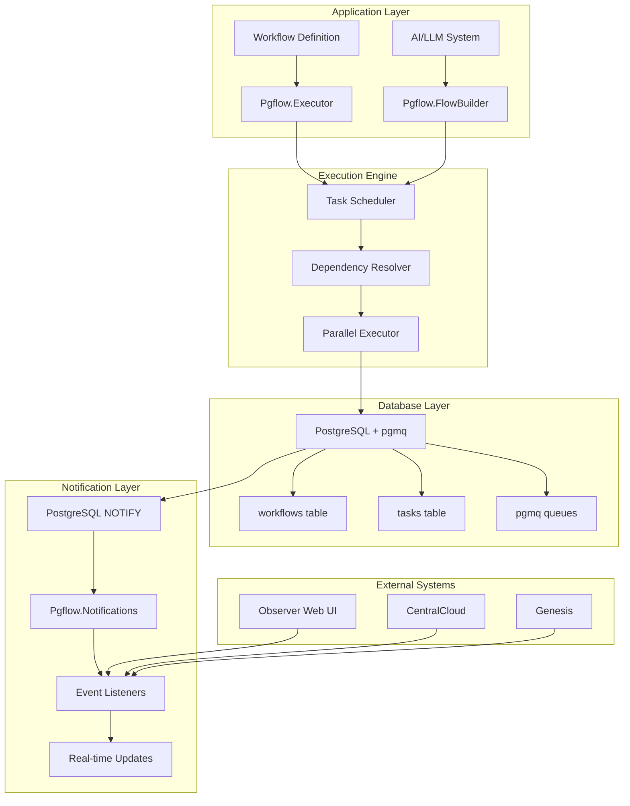

### PGMQ + NOTIFY Flow

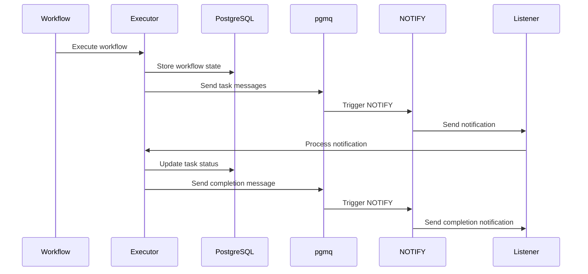

## 🔄 Workflow Execution Flow

### Static Workflow Execution

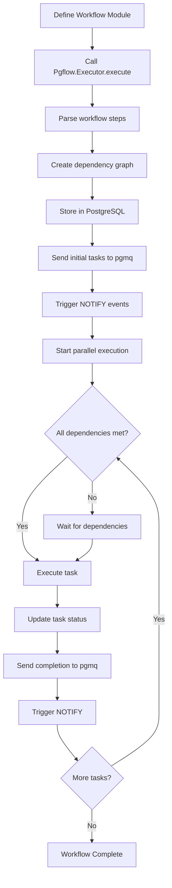

### Dynamic Workflow Creation

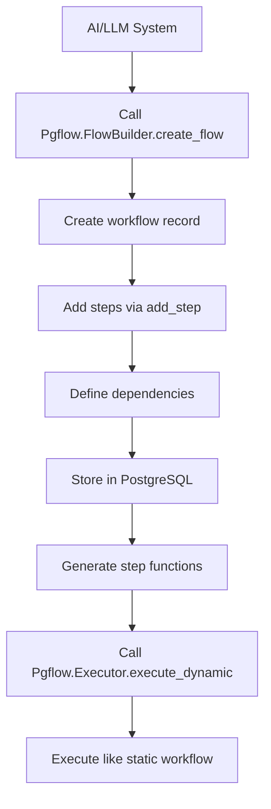

## 🔔 Notification System

### NOTIFY Event Flow

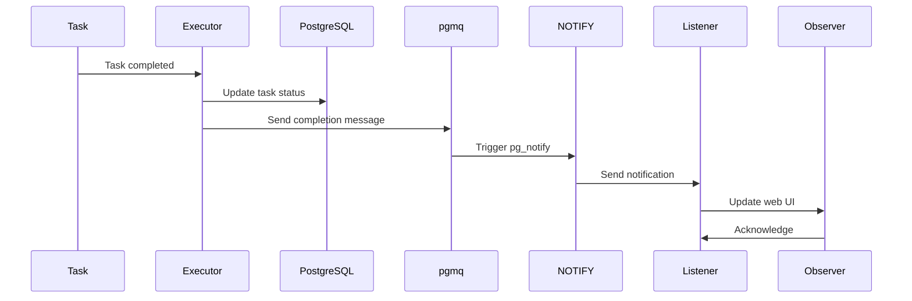

### Notification Types and Flow

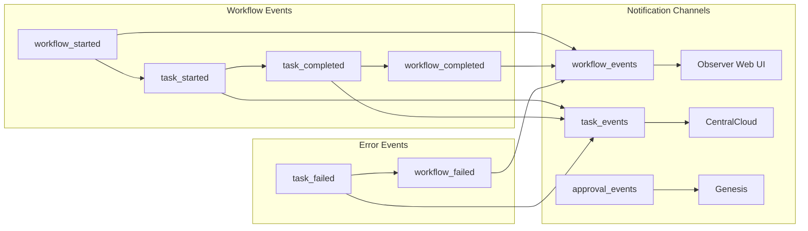

## 📊 Data Flow Architecture

### Complete Data Flow

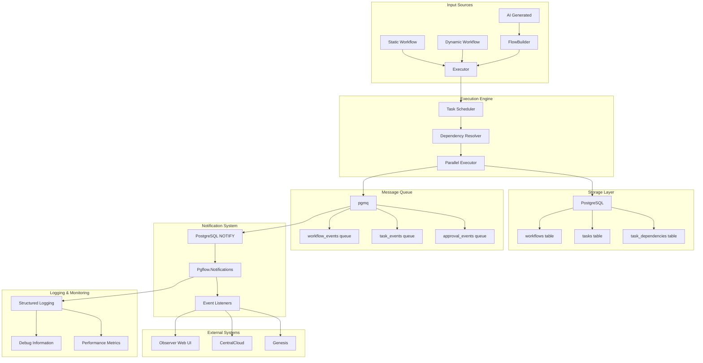

## 🧪 Testing Architecture

### Test Flow

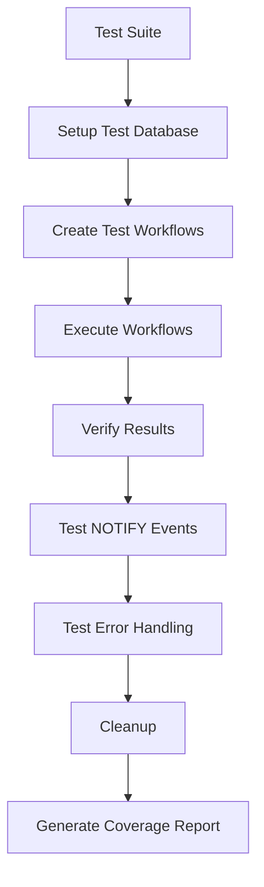

### Integration Testing

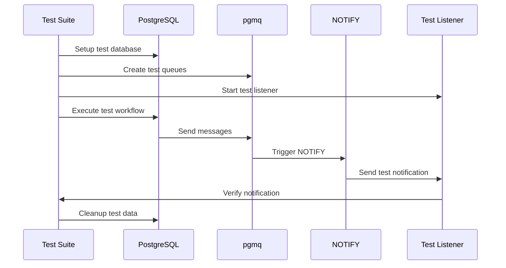

## 🚀 Deployment Architecture

### Production Deployment

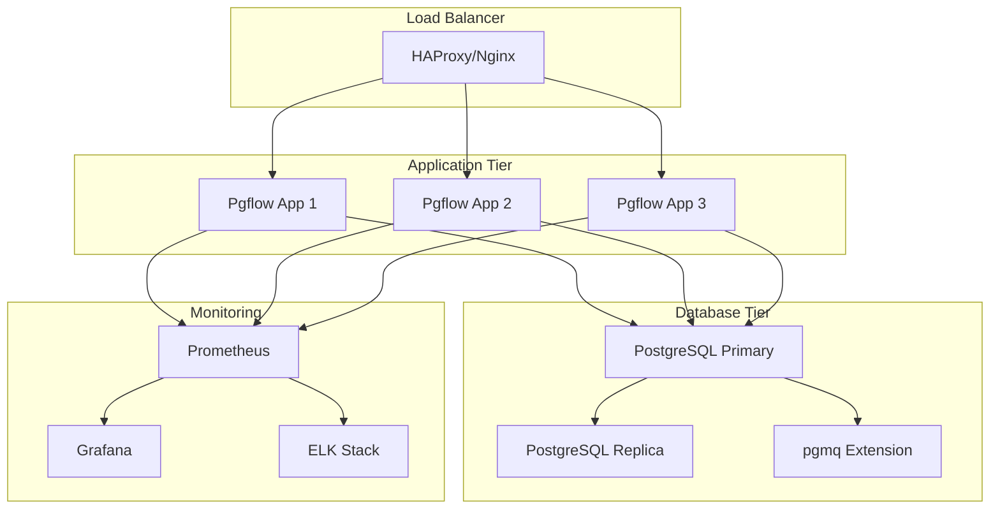

### Kubernetes Deployment

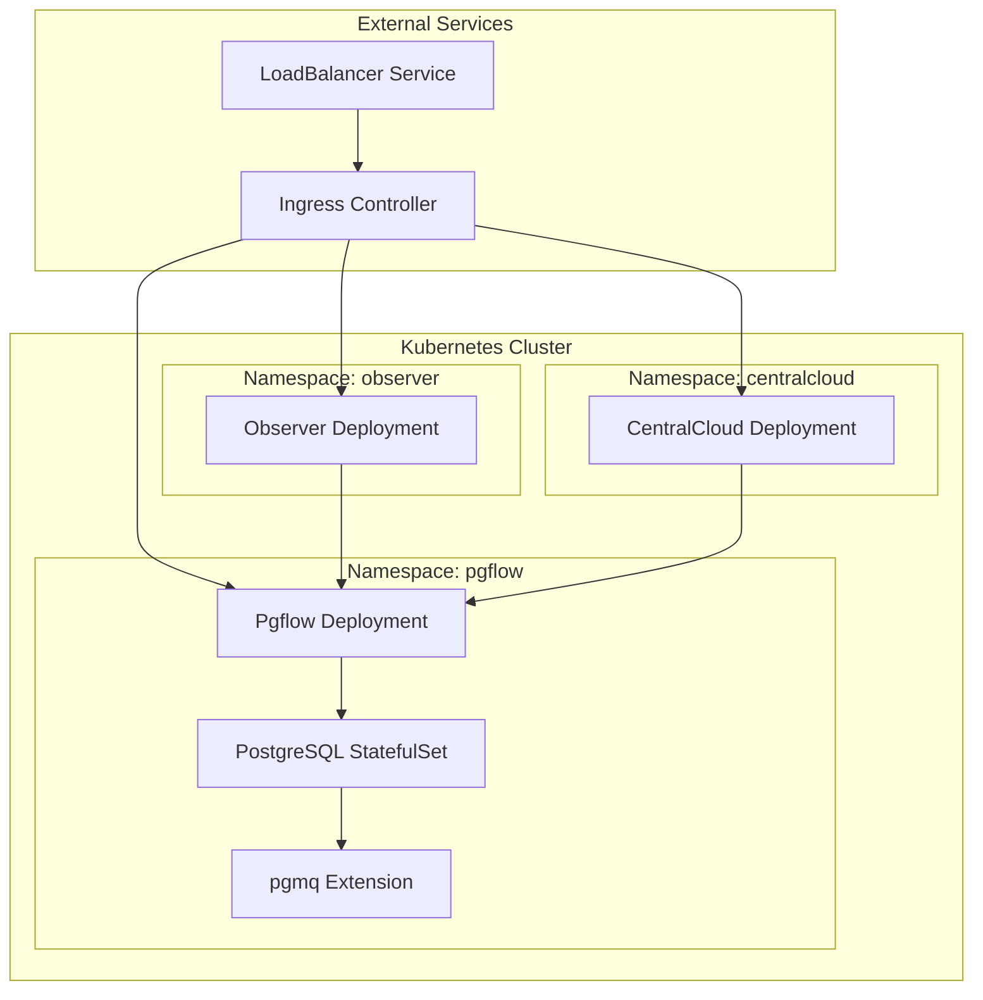

## 🔧 Configuration Flow

### Configuration Management

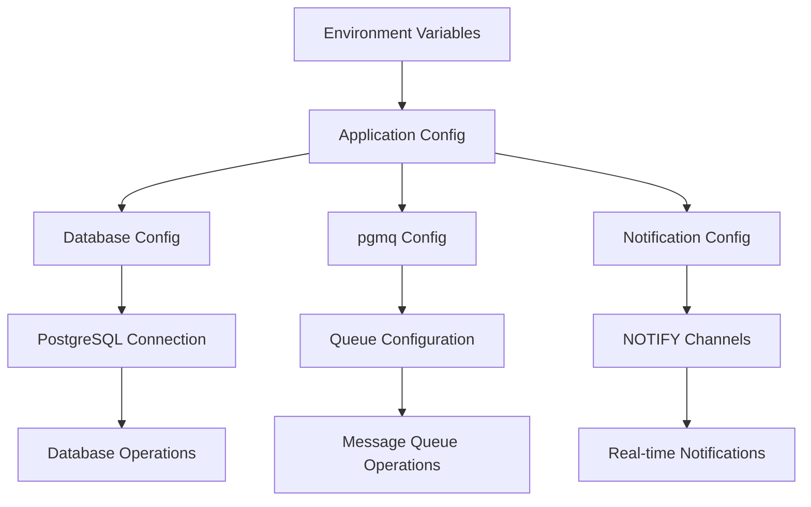

## 📈 Performance Monitoring

### Monitoring Flow

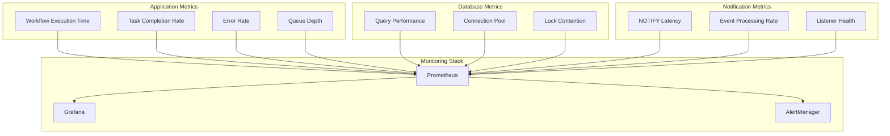

## 🎯 Use Case Flows

### AI Workflow Generation

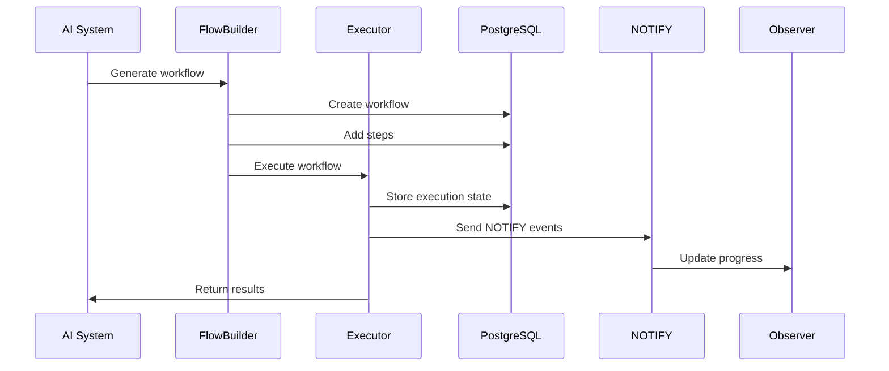

### Multi-Instance Coordination

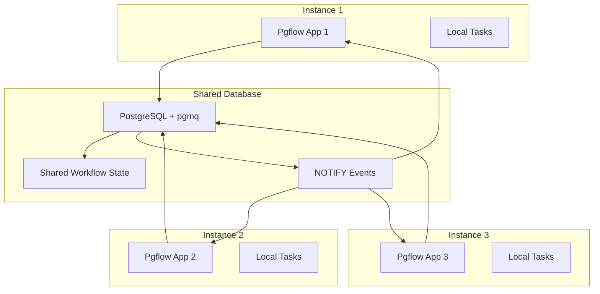

These diagrams provide a comprehensive view of the Pgflow architecture, showing how PGMQ + NOTIFY integration works across all layers of the system.