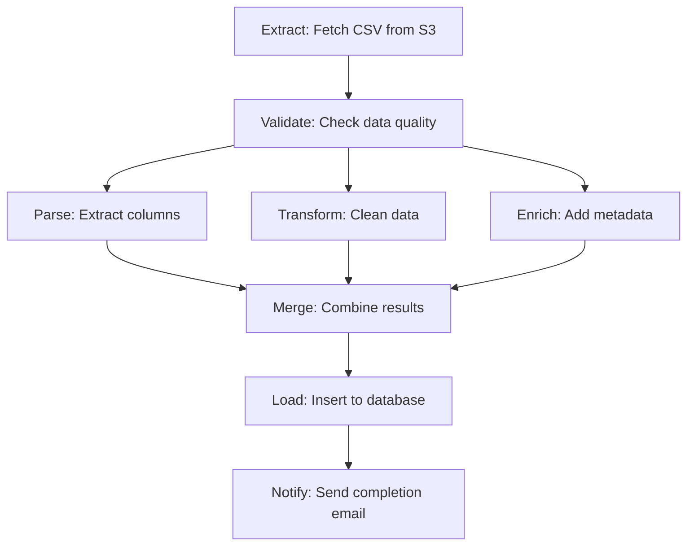

# ETL Pipeline Example

**Complete, production-ready** ETL (Extract-Transform-Load) pipeline demonstrating ex_pgflow workflow orchestration.

## What This Demonstrates

- ✅ **Sequential steps** - Classic ETL: Extract → Transform → Load
- ✅ **Parallel processing** - Fan-out for concurrent data processing
- ✅ **Map steps** - Process arrays with dynamic task creation
- ✅ **Error handling** - Retry logic and failure recovery
- ✅ **Dependency management** - Steps wait for prerequisites
- ✅ **Database-driven execution** - Full pgflow architecture

## Architecture



## Workflow Definition

### Option 1: Simple Sequential ETL

```elixir
defmodule MyApp.SimpleETL do
  @moduledoc """
  Basic ETL workflow: Extract → Transform → Load
  """

  def __workflow_steps__ do
    [
      {:extract, &__MODULE__.extract/1},
      {:transform, &__MODULE__.transform/1},
      {:load, &__MODULE__.load/1}
    ]
  end

  def extract(%{source: source}) do
    # Fetch data from source (S3, API, database, etc.)
    case fetch_from_source(source) do
      {:ok, raw_data} ->
        {:ok, %{raw_data: raw_data, row_count: length(raw_data)}}
      {:error, reason} ->
        {:error, "Extract failed: #{inspect(reason)}"}
    end
  end

  def transform(%{raw_data: raw_data}) do
    # Clean, validate, and transform data
    transformed =
      raw_data
      |> Enum.map(&clean_row/1)
      |> Enum.filter(&valid_row?/1)
      |> Enum.map(&add_metadata/1)

    {:ok, %{transformed_data: transformed, processed_count: length(transformed)}}
  end

  def load(%{transformed_data: data}) do
    # Insert data into target database
    case MyApp.Repo.insert_all(MyApp.DataTable, data) do
      {count, _} ->
        {:ok, %{loaded_count: count}}
      error ->
        {:error, "Load failed: #{inspect(error)}"}
    end
  end

  # Helper functions
  defp fetch_from_source(source), do: MyApp.DataSource.fetch(source)
  defp clean_row(row), do: Map.update!(row, :name, &String.trim/1)
  defp valid_row?(row), do: Map.has_key?(row, :id)
  defp add_metadata(row), do: Map.put(row, :imported_at, DateTime.utc_now())
end
```

**Usage:**

```elixir
# Run the workflow
{:ok, result} = Pgflow.Executor.execute(
  MyApp.SimpleETL,
  %{source: "s3://my-bucket/data.csv"},
  MyApp.Repo
)

# Result contains output from final step
result.loaded_count  # => 1000
```

### Option 2: Parallel Processing ETL

```elixir
defmodule MyApp.ParallelETL do
  @moduledoc """
  ETL with parallel processing for faster execution
  """

  def __workflow_steps__ do
    [
      # Extract
      {:extract, &__MODULE__.extract/1, depends_on: []},

      # Parallel transform steps
      {:validate, &__MODULE__.validate/1, depends_on: [:extract]},
      {:clean, &__MODULE__.clean/1, depends_on: [:extract]},
      {:enrich, &__MODULE__.enrich/1, depends_on: [:extract]},

      # Merge and load
      {:merge, &__MODULE__.merge/1, depends_on: [:validate, :clean, :enrich]},
      {:load, &__MODULE__.load/1, depends_on: [:merge]}
    ]
  end

  def extract(%{source: source}) do
    raw_data = fetch_from_source(source)
    {:ok, %{raw_data: raw_data}}
  end

  def validate(%{raw_data: data}) do
    # Validate data quality
    errors = Enum.filter(data, fn row ->
      not valid_schema?(row)
    end)

    if length(errors) > length(data) * 0.1 do
      {:error, "Too many validation errors: #{length(errors)}"}
    else
      {:ok, %{validation_errors: length(errors)}}
    end
  end

  def clean(%{raw_data: data}) do
    # Clean and normalize
    cleaned = Enum.map(data, &clean_row/1)
    {:ok, %{cleaned_data: cleaned}}
  end

  def enrich(%{raw_data: data}) do
    # Add external metadata
    enriched = Enum.map(data, fn row ->
      metadata = fetch_metadata(row.id)
      Map.merge(row, metadata)
    end)
    {:ok, %{enriched_data: enriched}}
  end

  def merge(%{cleaned_data: cleaned, enriched_data: enriched}) do
    # Merge results from parallel steps
    merged = Enum.zip(cleaned, enriched)
    |> Enum.map(fn {c, e} -> Map.merge(c, e) end)

    {:ok, %{final_data: merged}}
  end

  def load(%{final_data: data}) do
    {count, _} = MyApp.Repo.insert_all(MyApp.DataTable, data)
    {:ok, %{loaded_count: count}}
  end
end
```

### Option 3: Map Step for Batch Processing

```elixir
defmodule MyApp.BatchETL do
  @moduledoc """
  ETL with map step for processing large batches
  """

  def __workflow_steps__ do
    [
      # Fetch list of files to process
      {:list_files, &__MODULE__.list_files/1, depends_on: []},

      # Process each file in parallel (map step)
      {:process_file, &__MODULE__.process_file/1, depends_on: [:list_files]},

      # Aggregate results
      {:aggregate, &__MODULE__.aggregate/1, depends_on: [:process_file]}
    ]
  end

  def list_files(%{bucket: bucket}) do
    # Returns array of file paths - triggers map step
    files = MyApp.S3.list_objects(bucket)
    {:ok, files}  # Output is array → process_file creates N tasks
  end

  def process_file(file_path) do
    # Each file processed independently in parallel
    data = MyApp.S3.download(file_path)
    transformed = transform_data(data)
    {count, _} = MyApp.Repo.insert_all(MyApp.DataTable, transformed)

    {:ok, %{file: file_path, count: count}}
  end

  def aggregate(results) do
    # Collect results from all file processing tasks
    total = results
    |> Map.values()
    |> Enum.sum(& &1.count)

    {:ok, %{total_records: total}}
  end
end
```

## Running the Examples

### 1. Define your workflow module

Copy one of the examples above or create your own.

### 2. Execute the workflow

```elixir
# Simple ETL
{:ok, result} = Pgflow.Executor.execute(
  MyApp.SimpleETL,
  %{source: "s3://bucket/data.csv"},
  MyApp.Repo
)

# Parallel ETL
{:ok, result} = Pgflow.Executor.execute(
  MyApp.ParallelETL,
  %{source: "s3://bucket/data.csv"},
  MyApp.Repo,
  timeout: 300_000  # 5 minutes
)

# Batch ETL
{:ok, result} = Pgflow.Executor.execute(
  MyApp.BatchETL,
  %{bucket: "my-data-bucket"},
  MyApp.Repo
)
```

### 3. Monitor execution

```elixir
# Check workflow status
{:ok, status, info} = Pgflow.Executor.get_run_status(run_id, MyApp.Repo)

case status do
  :completed -> IO.inspect(info, label: "Final result")
  :failed -> IO.inspect(info, label: "Error")
  :in_progress -> IO.inspect(info, label: "Progress")
end
```

## Error Handling

### Automatic Retries

```elixir
def extract(%{source: source}) do
  case fetch_with_retry(source, max_attempts: 3) do
    {:ok, data} -> {:ok, %{raw_data: data}}
    {:error, reason} -> {:error, reason}
  end
end

defp fetch_with_retry(source, opts) do
  max_attempts = Keyword.get(opts, :max_attempts, 1)

  # ex_pgflow handles retries automatically via database
  # Just return {:error, reason} and it will retry
  MyApp.S3.download(source)
end
```

### Graceful Degradation

```elixir
def enrich(%{raw_data: data}) do
  # Try to enrich, but don't fail if enrichment service is down
  enriched = Enum.map(data, fn row ->
    case fetch_metadata(row.id) do
      {:ok, metadata} -> Map.merge(row, metadata)
      {:error, _} -> row  # Continue without enrichment
    end
  end)

  {:ok, %{enriched_data: enriched}}
end
```

## Performance Optimization

### 1. Batch Size Tuning

```elixir
def list_files(%{bucket: bucket}) do
  # Don't create 10,000 tasks - batch them
  files = MyApp.S3.list_objects(bucket)

  batches = Enum.chunk_every(files, 100)  # 100 files per task
  {:ok, batches}
end

def process_file(batch) do
  # Process batch of files
  results = Enum.map(batch, &process_single_file/1)
  {:ok, %{processed: length(results)}}
end
```

### 2. Database Connection Pooling

```elixir
# config/config.exs
config :my_app, MyApp.Repo,
  pool_size: 20,  # Increase for parallel workflows
  queue_target: 5000,
  queue_interval: 1000
```

### 3. Timeout Configuration

```elixir
# Per-workflow timeout
{:ok, result} = Pgflow.Executor.execute(
  MyApp.LargeETL,
  input,
  MyApp.Repo,
  timeout: 3_600_000  # 1 hour for large datasets
)
```

## Testing

```elixir
defmodule MyApp.SimpleETLTest do
  use ExUnit.Case, async: false

  test "extracts data from source" do
    input = %{source: "test://fake-data"}
    {:ok, result} = MyApp.SimpleETL.extract(input)

    assert result.raw_data
    assert result.row_count > 0
  end

  test "transforms data correctly" do
    input = %{raw_data: [%{name: "  John  ", id: 1}]}
    {:ok, result} = MyApp.SimpleETL.transform(input)

    assert hd(result.transformed_data).name == "John"
  end

  test "full workflow execution" do
    {:ok, result} = Pgflow.Executor.execute(
      MyApp.SimpleETL,
      %{source: "test://small-dataset"},
      MyApp.Repo
    )

    assert result.loaded_count > 0
  end
end
```

## Production Considerations

### 1. Idempotency

```elixir
def load(%{transformed_data: data}) do
  # Use upsert to make loads idempotent
  MyApp.Repo.insert_all(
    MyApp.DataTable,
    data,
    on_conflict: {:replace, [:updated_at, :data]},
    conflict_target: :id
  )

  {:ok, %{loaded_count: length(data)}}
end
```

### 2. Monitoring

```elixir
def extract(%{source: source}) do
  start_time = System.monotonic_time()

  result = fetch_from_source(source)

  duration = System.monotonic_time() - start_time
  :telemetry.execute([:etl, :extract], %{duration: duration}, %{source: source})

  result
end
```

### 3. Logging

```elixir
require Logger

def transform(%{raw_data: raw_data}) do
  Logger.info("Transforming #{length(raw_data)} rows")

  transformed = perform_transformation(raw_data)

  Logger.info("Transformation complete: #{length(transformed)} rows")
  {:ok, %{transformed_data: transformed}}
end
```

## Common Patterns

### Pattern 1: Multi-Stage ETL

```
Extract → Validate → Transform → Enrich → Aggregate → Load → Notify
```

### Pattern 2: Fan-Out/Fan-In

```
Extract → [Process1, Process2, Process3] → Merge → Load
```

### Pattern 3: Incremental Processing

```
GetLastTimestamp → FetchNew → ProcessDelta → UpdateState
```

### Pattern 4: Error Quarantine

```
Extract → Validate → [Clean, Quarantine] → Load
```

## Troubleshooting

### Workflow Stuck

```elixir
# Check workflow status
{:ok, status, info} = Pgflow.Executor.get_run_status(run_id, MyApp.Repo)

# Query database directly
import Ecto.Query
from(s in Pgflow.StepState, where: s.run_id == ^run_id)
|> MyApp.Repo.all()
```

### Step Failing Repeatedly

```elixir
# Check error messages
from(t in Pgflow.StepTask,
  where: t.run_id == ^run_id and t.status == "failed",
  select: {t.step_slug, t.error_message}
)
|> MyApp.Repo.all()
```

### Performance Issues

```elixir
# Check step durations
from(t in Pgflow.StepTask,
  where: t.run_id == ^run_id,
  select: {
    t.step_slug,
    fragment("EXTRACT(EPOCH FROM (? - ?))", t.completed_at, t.started_at)
  }
)
|> MyApp.Repo.all()
```

## See Also

- [ex_pgflow Architecture](../../ARCHITECTURE.md) - How workflows execute
- [Phoenix Dashboard Example](../phoenix_dashboard/) - Monitor workflows
- [Pgflow.Executor](../../lib/pgflow/executor.ex) - Execution API
